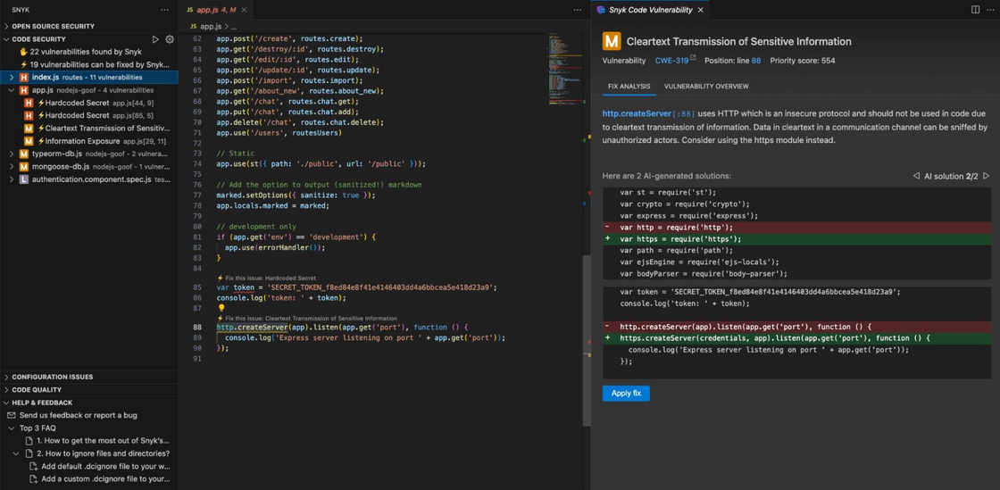

# Snyk Product Updates


Subscribe to the [RSS feed](https://raw.githubusercontent.com/snyk/product-updates-docs/main/rss) so you don't miss any updates.


***

## Snyk AppRisk Pro now available

May 1, 2024

**New**

We're thrilled to announce that Snyk AppRisk Pro is now available. Snyk AppRisk Pro expands on Snyk AppRisk’s core capabilities of application discovery & visibility, security coverage management, and risk-based prioritization with the following new capabilities:

* **Application Analytics** - a new data analytics capability offering AppSec teams a comprehensive overview of their AppSec program at a macro level, facilitating tracking, measurement, and reporting on program performance and risk KPIs.
* **Extended security coverage visibility** - new integrations with Nightfall AI and GitGuardian extend visibility of Snyk AppRisk to secret detection tools for managing security coverage on your repositories.
* **Risk based prioritization with runtime intelligence** - integrations with leading security and observability solutions, as well as a new, eBPF-based Snyk runtime sensor, provide runtime context to enable security teams to prioritize what to fix first and to assess any gaps in Snyk Container coverage vs. running containers. These runtime data sources are in a closed beta.

To learn more, please reference our product documentation and reach out to your account team with any questions.

***

## Filter through your audit logs more efficiently with the new GA REST version of the audit logs API, and api.access is now opt-in

April 30, 2024

**New**, **Improved**

We've made some great new improvements to our existing GA REST audit log API to help you filter and find the logs you need more efficiently:

1. **Filter over time** - Previously, users faced challenges filtering audit logs due to the smallest unit being within a day. This difficulty escalates for users who may need to sift through millions of logs to find specific events. Now, by expanding filtering options to larger time periods and reducing the minimum granularity to 1-second ranges, customers can broaden their search while pinpointing crucial audit events like security breaches or for external audits.
2. **Exclude events** - some users can have millions of audit logs being produced every day so they need the ability to exclude certain events to reduce the noise of what they have to sieve through. We already have exclude events in the API today but you can only provide 1 include or exclude event, so we’ve improved this by providing multiple include and exclude events.

For more information, check out the [API documentation](https://apidocs.snyk.io/?version=2024-04-29#get-/groups/-group\_id-/audit\_logs/search), and we hope you update your version and enjoy these new improvements soon!

In addition, we are making `api.access` endpoint to be opt-in for users rather than automatically returning results due to feedback that `api.access` causes noise problems. We’re actively working towards a proper audit event for actions.

***

## Introducing Semantic Versioning, and Release Channels to Snyk CLI

April 30, 2024

**New**

We are pleased to introduce Semantic Versioning and Release Channels to Snyk CLI from [v.1.1291.0](https://github.com/snyk/cli/releases/tag/v1.1291.0) onwards. These changes will allow all Snyk customers to select a sustainable release cadence that works for them, and help optimize governance and compliance overhead for enterprise customers.

Snyk CLI v.1.1291.0 follows three part MAJOR.MINOR.PATCH notation going forward, details for which are available in [product documentation](https://docs.snyk.io/snyk-cli/releases-and-channels-for-the-snyk-cli).

We are introducing the following release channels:

`preview` “pre-release” builds are deployed regularly up to multiple times a day and contain the latest changes.

* Version Pattern: v{MAJOR}.{MINOR}.{PATCH}-preview
* Cadence: Varying
* Availability:

```
- https://static.snyk.io/cli/preview/
- https://static.snyk.io/fips/cli/preview/
```

`rc` “release candidate” pre-releases are deployed at distinct points in time and contain a version of the CLI that is expected to be promoted to stable after additional testing

* Version Pattern: v{MAJOR}.{MINOR}.{PATCH}-rc
* Cadence: every 8 weeks, 2 weeks before a stable release _(hotfix releases possible)_
* Availability:

```
- https://static.snyk.io/cli/rc/
- https://static.snyk.io/fips/cli/rc/
```

`stable` stable builds are deployed at distinct points in time after being additionally tested and considered stable.

* Version Pattern: v{MAJOR}.{MINOR}.{PATCH}
* Cadence: every 8 weeks, end of an even month _(hotfix releases possible)_
* Availability:

```
- https://github.com/snyk/cli/releases/
- https://static.snyk.io/cli/stable/
- https://static.snyk.io/fips/cli/stable/
- npm
- brew
- scoop
- Snyk-images
```

Existing Snyk CLI, and supported IDEs users are opted into the stable channel by default. You can find more information on how to opt into a release channel of your choice in our [product documentation](https://docs.snyk.io/snyk-cli/releases-and-channels-for-the-snyk-cli).

***

## Snyk Code Improvements: New Sanitization Logic in Snyk Code

April 26, 2024

**Improved**

We are excited to announce an update to Snyk Code's sanitization logic, enhancing the accuracy of our SAST testing across all supported languages. This upgrade introduces argument position awareness to our taint analysis, significantly reducing false positives in vulnerability detection.

This update resolves inconsistencies previously seen, especially in interfile sanitization, where the behavior of functions defined and called across different files could lead to varying results. The new logic ensures consistent detection and reporting, improving the clarity and reliability of code security assessments.

Should you need further information or support, please contact your account team.

Thank you for using Snyk Code to enhance your application security.

***

## Snyk Code Improvements: Support for Python FastAPI

April 26, 2024

**Improved**

We are pleased to announce that Snyk Code now includes support for the FastAPI framework. This update enhances our ability to identify and analyze FastAPI-specific sources and sinks, improving the detection of security vulnerabilities in applications using this framework.

This new feature is integrated into Snyk Code’s existing scanning processes and is available for use immediately for all Python rules. We recommend conducting a fresh scan to benefit from the updated functionality.

As always, our goal is to assist you in enhancing your application's security by providing precise, framework-specific vulnerability detection. For detailed information or support, please reach out to your account team.

Thank you for using Snyk Code to secure your software development.

***

## DeepCode AI Fix - VS Code UX Improvements

April 24, 2024

**Improved**

We are very happy to introduce an improved DeepCode AI Fix experience for Visual Studio Code. Developers will have a more streamlined experience by:

* Having visibility of how many issues are autofixable
* Being able to generate fixes from the issue details panel
* Having a preview of the possible fixes before they are applied
* Guidance to the code that has changed

These improvements come on top of our general fix quality improvements we have been working on, which you can read about on our [new blog post!](https://snyk.io/blog/ai-code-security-snyk-autofix-deepcode-ai/)

For details on how to get started with DeepCode AI Fix and start fixing Snyk Code issues, please visit our [documentation](https://docs.snyk.io/scan-with-snyk/snyk-code/manage-code-vulnerabilities/fix-code-vulnerabilities-automatically#enable-deepcode-ai-fix).

<figure><figcaption></figcaption></figure>

***

## Test an SBOM using the Snyk CLI

April 19, 2024

**Early Access**

We are very pleased to announce that you can now use the Snyk CLI to scan CycloneDX and SPDX SBOM files!

Snyk has enabled SBOM testing [via the API](https://apidocs.snyk.io/?version=2023-08-31\~beta#post-/orgs/-org\_id-/sbom\_tests) for a while. Adding this to the CLI makes it significantly easier to test SBOMs produced using other tools, or SBOMs received from 3rd-party vendors.

To get started install Snyk CLI [v1.1290](https://github.com/snyk/cli/releases/tag/v1.1290.0) or above, and run the following command (using your actual SBOM file name 😉).

```cli
snyk sbom test --experimental --file=bom.cdx.json
```

This feature is in Open Beta, the following SBOM formats are currently supported.

* CycloneDX: JSON version 1.4 and 1.5
* SPDX: JSON version 2.3

See `snyk help` or [Snyk User Docs](https://docs.snyk.io/snyk-cli/commands/sbom-test) for more usage details 🙌

***

## Free Plans Test Enforcement - Phase 1

April 16, 2024

**New**

For customers on free plans, we plan to implement hard enforcements on monthly test limits. Specifically, we are starting work on the enforcement of test limits through the push flow. The work will begin on Monday, April 29th and plan to be complete by Thursday, May 2nd.

Please be aware that this feature will only impact customers on the free plan, who do not pay for any Snyk products. Customers with one or more paid products will not be affected by this feature.

***

## Updated Project Page Layout

April 12, 2024

**Improved**

For your awareness, minor updates to our Project page will be introduced over the next week. In the topmost heading, tabs related to the project overview, history, and settings are migrating higher on the page. In addition, modifications will be made to the project breadcrumbs.

Please be aware any temporary inconsistencies between organizations will resolve themselves shortly!

***

## Automated Collections (Early Access)

April 12, 2024

**New**

We’re happy to introduce Automated Collections to help you easily manage all your Snyk Projects.

With Automated Collections enabled, similar Projects from different integration types are automatically grouped into a collection to filter and report on the issues of your preferred scanning method easily and hide duplicate results.

You’ll find the option to enable Automated Collections under a new entry in the Organization Settings menu. After Automated Collections are enabled, it may take minutes (up to an hour) to analyze all the Organization’s Projects and group them by their Target URL.

**Please note** that Collections and Automated Collections are only available for customers on the Snyk Enterprise plan. Read more about how [automatically created Project collections](https://docs.snyk.io/snyk-admin/snyk-projects/automatically-created-project-collections) help you track issues, and contact your account team with any questions.

***

## Configurable Python version in Snyk Open Source SCM scans is now GA!

April 3, 2024

**New**

We are very pleased to announce that the option to define Python minor version when scanning pip projects via Git integrations is now GA!

Until now, Snyk would always use either Python 2.7 or 3.7 which could lead to some dependencies being omitted from results if they require newer versions.

You can now specify minor versions of Python 3 to use in scans, up to 3.12.

To try this out go to Settings > Languages > Python and specify the Python version to use.

For more details see the documentation [available here](https://docs.snyk.io/scan-using-snyk/supported-languages-and-frameworks/python#pip-and-python-versions).

***

## Snyk AppRisk Essentials: New features and unified UI

March 28, 2024

**New**

We're thrilled to announce the following improvements to Snyk AppRisk Essentials, which are available today on our platform:

**Snyk AppRisk is now unified into the Snyk platform user interface**. This eliminates the need to switch between separate web browser tabs. All Snyk AppRisk capabilities are available on Snyk’s main navigation menu at the Group level, and these navigation changes do not introduce any breaking changes.

**The Snyk AppRisk asset inventory now includes** [**aggregate counts of Snyk issues**](https://docs.snyk.io/manage-risk/snyk-apprisk/inventory-for-snyk-apprisk#assets-and-their-attributes) in the asset inventory for Snyk Open Source, Snyk Code, and Snyk Container. From a specific asset, you can navigate to the Insights UI to see more details on the issues that relate to the given asset.

**Support for images as assets**. Snyk AppRisk now provides visibility into [image assets](https://docs.snyk.io/manage-risk/snyk-apprisk/inventory-for-snyk-apprisk/inventory-capabilities#image-assets) scanned using Snyk Container. Image assets can be tagged and managed with policies (for example, for asset classification). Where relevant, Issue counts from Snyk Container issues are aggregated on the image asset.

Please reach out to your account team if you have any questions on the above.

***

## Snyk AppRisk - Bring Backstage Data into AppRisk

March 25, 2024

**New**

We're pleased to share that Snyk AppRisk will allow customers to bring Backstage data into AppRisk as their org context information. You can now see the repo assets in AppRisk with the Backstage catalog info yaml file; this will make it easy for our user to manage their repo assets.

What is this feature about? Enable customers to add catalog info yaml, allow the customer to bring their organizational context into AppRisk. Enrich repo assets with metadata from Backstage. This allows customers to filter the asset inventory and build policies based on Backstage metadata.

This feature will be available for AppRisk Essentials and AppRisk Pro, which will be available for all SCM integrations that AppRisk supports.

Please see our [Snyk documentation](https://docs.snyk.io/manage-risk/snyk-apprisk/integrations-for-snyk-apprisk/backstage-file-for-scm-integrations) for more details, and contact your account team with any questions.

***

## Snyk AppRisk - Two new filters in Policy Builder

March 18, 2024

**New**

We're excited to introduce two new filters to AppRisk Policies - “Repository Freshness” and “Source”. The two new filters unlock new use cases for policy creation. For example, users can now fine-tune policies with “repository freshness” condition to ignore inactive repositories. Additionally, they can take different actions for assets originating from different sources.

Previously available only in Asset Inventory, these two filters are now seamlessly integrated into AppRisk Policies as well. For more information, please refer to [Snyk documentation](https://docs.snyk.io/manage-risk/snyk-apprisk/policies-for-snyk-apprisk/create-policies).

***

## License issues alignment in reporting

February 29, 2024

**Improved**

In about a week, Snyk will update the logic for **counting license issues** in both Reports and Enterprise Analytics pages to better align with the way license issues are counted in Snyk projects page and Issues API. This will provide customers with a more consistent user experience across Snyk platform and ensure that license issue counts received from different Snyk interfaces are aligned. Customers using Snyk Open Source will see fewer issues in reporting once this change is applied, as the paths by which an issue is introduced will no longer be counted separately. Please reach out to your account team with any questions.

***

## New CWE TOP 10 KEV (Known Exploited Vulnerabilities) Report

February 26, 2024

**New**

We are happy to share the availability of a new report - **CWE TOP 10 KEV** (Known Exploited Vulnerabilities).

**CISA**:

* In 2021, the [Cybersecurity and Infrastructure Security Agency (CISA)](https://www.dhs.gov/cisa/cybersecurity-division) began publishing the [Known Exploited Vulnerabilities (KEV) Catalog](https://www.cisa.gov/known-exploited-vulnerabilities-catalog).
* The CVEs in this catalog are vulnerabilities reported as actively exploited. CISA recommends that organizations monitor the KEV catalog and use its content to help prioritize remediation activities in their systems to reduce the likelihood of compromise.

**The new KEV report**:

* In December 2023, MITRE published an analysis of the TOP 10 exploitable CWEs for the first time. For each CWE, MITRE looked at how many CVEs are assigned to it in the KEV catalog and their average CVSS score.
* The list contains [10 prioritized CWEs](https://cwe.mitre.org/top25/archive/2023/2023\_kev\_list.html) that, if addressed, can reduce the risk of exploitation.

The new report provides an additional approach to managing and prioritizing risk according to industry standards in addition to the OWASP TOP 10 (2021) and the CWE TOP 25 (2023) reports.

Learn more by reading the documentation [available here](https://docs.snyk.io/manage-risk/reporting/available-snyk-reports).

***

## Targets API endpoint release to GA!

February 26, 2024

**New**, **Deprecated**

Following the release of the [Targets API beta](https://apidocs.snyk.io/?version=2024-01-04\~beta#tag--Targets), we were given feedback that users had some issues with the naming conventions, would like to see the prefix updated to be consistent with standards used in other endpoints, and we were also given feedback that we’re missing various fields and filters which were supported in other versions of the API (including via the projects API).

With that, we're proud to announce that we've taken that feedback on board, addressed the points, and have released the [GA version of the Targets API](https://apidocs.snyk.io/?version=2024-02-21#get-/orgs/-org\_id-/targets)!

With the GA release of any API in Snyk, the GA release of this endpoint (which is a huge improvement on the beta) means the beta version is automatically deprecated, and users are highly recommended to upgrade to the GA version as soon as possible.

We are not removing the beta endpoint yet, and you can still continue using it.

However, after 90 days, we can remove the API endpoint. We will communicate regularly that the GA endpoint is available to upgrade to, and that we will remove the endpoint as we approach the time.

When we remove the beta API, you will be greeted by an `http 404 error`, and the simple fix is to upgrade to the latest version.

***

## Revamped Group-Level Organization Page

February 18, 2024

**Improved**

The Group Organizations page for Enterprise customers just got a facelift!

The new cleaner look makes viewing your Organizations and joining new ones a breeze. The new page is faster and includes a brand-new workflow for joining Organizations without the need for manual emails.

Read more about how to [request access to an Organization](https://docs.snyk.io/snyk-admin/manage-users-in-organizations-and-groups/requests-for-access-to-an-organization).

***

## Snyk Container - Custom base image recommendations is now GA

February 12, 2024

**New**

We are excited to announce the GA release of the Custom Base Image Recommendations feature of Snyk Container, bringing a more customized experience to our enterprise customers, allowing developers to utilize the most secure images from their organizations' internal pool of approved images (often referred to as “golden images”).

The General Availability version delivers:

* API endpoints for all custom base image actions to allow automation and smooth integration into existing processes.
* All API functionality is now also available in the browser GUI, allowing users to define custom versioning schemas from the project’s settings.
* Removed feature flag - by default, Custom Base Image Recommendations settings will be shown in the project’s settings.


**Please note** that this feature is only available for customers on the Snyk **Enterprise** plan. More details on the feature are available in the [public](https://docs.snyk.io/products/snyk-container/getting-around-the-snyk-container-ui/custom-base-image-recommendations) and [API](https://apidocs.snyk.io/?version=2024-01-23#tag--Custom-Base-Images) documentation.


***

## Snyk AppRisk - Policy Templates

February 5, 2024

**New**

We are happy to announce Policy Templates for Snyk AppRisk.

Policy Templates help AppRisk users create policies by offering ready-to-use templates that cover common use cases. In addition to creating a policy from scratch, users can now start with one of four out-of-the-box templates and tailor it to their unique requirements.

For more information, please refer to [Snyk documentation](https://docs.snyk.io/manage-risk/snyk-apprisk/policies-for-snyk-apprisk/create-policies#use-a-template-policy-creation) and watch the Policy Templates overview [video](https://www.youtube.com/embed/CtC7tGGNijY).

***

## The New REST Issues API is now GA

January 29, 2024

**New**

We are excited to announce the General Availability of the Unified Issues API, which unifies all Snyk issues (SCA, SAST, IaC+) across projects or orgs into one API call. The Unified Issues API approach offers several key benefits:

* Simplifies the user experience with one paginated API call across all projects or orgs
* Saves time by eliminating the need to stitch data across API calls and offering a consistent schema to parse responses with
* Highlights our commitment to building Snyk as a holistic security platform for our customers

The General Availability delivers:

* Uniform issue representation from Code to IaC+, with improved data quality and increased reliability
* Detailed representations for Open Source packages and fix information
* Improved pagination and response management, simplifying the API interaction
* New filters for tailored API responses, catering to specific querying needs

Please check out the API docs for [listing all issues by group](https://apidocs.snyk.io/?version=2024-01-23#get-/groups/-group\_id-/issues), and [by org](https://apidocs.snyk.io/?version=2024-01-23#get-/orgs/-org\_id-/issues).

**Note**: the experimental versions of this endpoint will be deprecated in 30 days, while the beta version will be deprecated in 90 days. If you have any concerns with the deprecation timelines for experimental or beta endpoints of this API, please contact your account representative.

***

## Snyk AppRisk - View Only Permission

January 29, 2024

**New**

We are pleased to announce that the Snyk AppRisk support View Only permission.

View Only permission for Snyk AppRisk will enable you to give view only permission to Snyk AppRisk, so it is minimizes the need for you to give full access to Snyk AppRisk to your team members.

For more details, see the documentation [available here](https://docs.snyk.io/manage-risk/snyk-apprisk/getting-started-with-snyk-apprisk#permissions).

***

## Snyk Code - DeepCode AI Fix now supports 7 languages

January 29, 2024

**New**, **Improved**

[DeepCode AI Fix](https://docs.snyk.io/scan-using-snyk/snyk-code/exploring-and-working-with-snyk-code-results-in-the-web-ui/fix-code-issues-automatically-with-deepcode-ai-fix-suggestions) helps you automatically fix security issues identified by Snyk Code in the IDE (VS Code and Eclipse) using Snyk's DeepCode AI model.

Over the last few months, the team has been continuously adding depth to JS/TS fixes, and we are excited to share the support for 6 additional languages. DeepCode AI Fix now supports:

* Javascript and Typescript
* Java
* Python
* C/C++
* Go (Limited support)
* C# (Limited support)
* APEX (Limited support)

Visit our documentation to learn [how to try it out](https://docs.snyk.io/scan-using-snyk/snyk-code/exploring-and-working-with-snyk-code-results-in-the-web-ui/fix-code-issues-automatically-with-deepcode-ai-fix-suggestions#enable-deepcode-ai-fix)!

***

## Snyk Open Source Gradle 8 CLI support

January 26, 2024

**Improved**

We are pleased to announce that the Snyk CLI now supports scanning [Gradle 8](https://gradle.org/whats-new/gradle-8/) projects!

Previously, when scanning version 8 projects in the CLI, some operations might fail due to incompatibility with the Gradle configuration cache. This has now been resolved, and Gradle 8 is [officially supported](https://docs.snyk.io/scan-using-snyk/supported-languages-and-frameworks/java-and-kotlin) in the Snyk CLI. 🎉

Upgrade to [CLI v1.1273.0](https://github.com/snyk/cli/releases/tag/v1.1273.0) or above to scan your Gradle 8 applications.

***

## Snyk CLI Improvement: Auth tokens redacted

January 8, 2024

**Improved**

With our customers and users security in mind, from version [v1.1268.0](https://github.com/snyk/cli/releases/tag/v1.1268.0) onwards, [Snyk CLI](https://docs.snyk.io/snyk-cli) will redact [Snyk API authentication tokens](https://docs.snyk.io/getting-started/how-to-obtain-and-authenticate-with-your-snyk-api-token) from its [debug](https://docs.snyk.io/snyk-cli/commands#debug) logs.

Once upgraded, when Snyk users run the following commands to enable Snyk CLI debug logs,

`DEBUG=* snyk test -d`

or

`DEBUG=snyk* snyk test -d`

they will see API authentication redacted and displayed as `***`.

An example of this change is inline:

```bash
// Some codesnyk request body size: 1219
snyk gzipped request body size: 666
snyk:req request payload: {"url": "https://api.snyk.io/v1/analytics/cli","json":true, "method": "post", "headers": {"authorization": "token ***" ,"x-snyk-cli-version"
```

Snyk API authentication tokens will be redacted from Snyk CLI debug logs for both [service](https://docs.snyk.io/enterprise-setup/service-accounts) as well as individual Snyk accounts.

We recommend upgrading to [v1.1268.0](https://github.com/snyk/cli/releases/tag/v1.1268.0) to benefit from this change.
