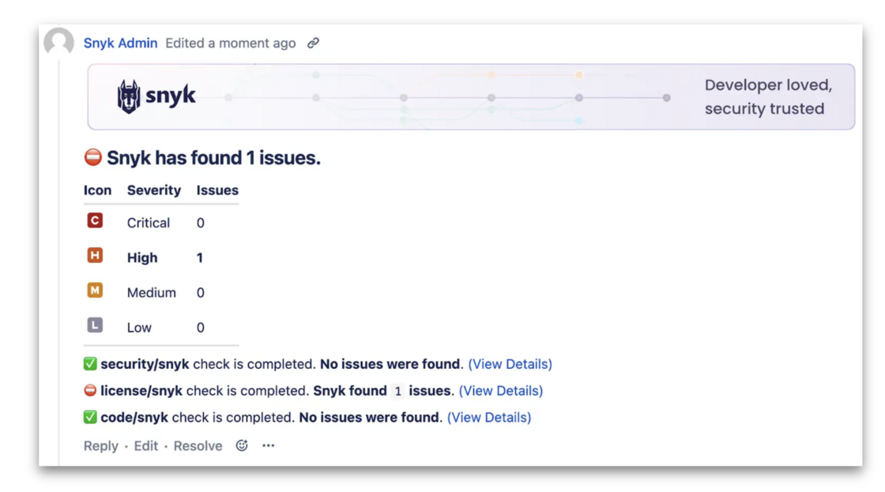
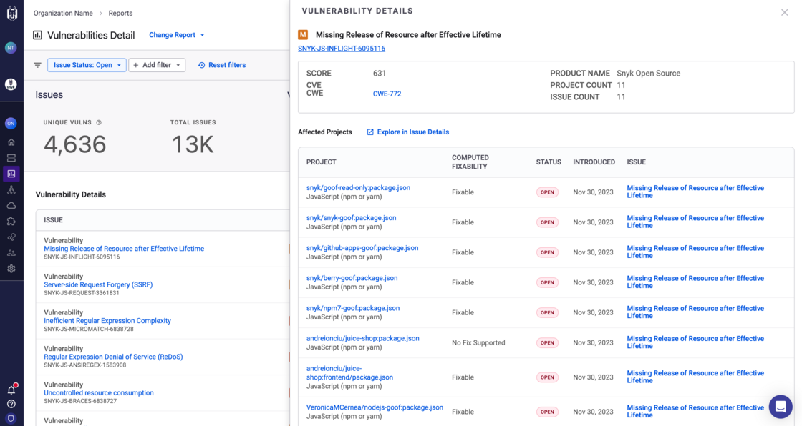
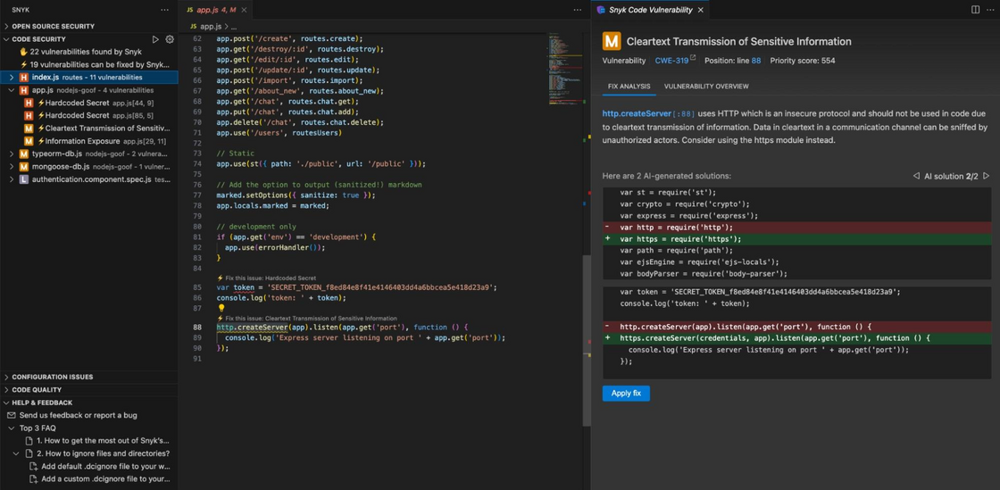

# Snyk Product Updates

***

## PR Comments (Closed Beta) are now available for BitBucket Server

September 25, 2024

**New**, **Closed Beta**

PR Comments for Snyk PR Checks, [announced in Closed Beta](https://headwayapp.co/snyk-io-updates/pr-comments-for-snyk-pr-checks-are-now-in-closed-beta-292934) earlier this year, now supports BitBucket Server!&#x20;

With this new feature enabled, customers using Snyk PR Checks will receive a new PR comment on each Pull Request that summarizes the most recent PR check results according to the type of check and severity of findings.

<figure><figcaption></figcaption></figure>

If you're interested in enabling this feature for your organization, please reach out to your account team.

***

## High-Context Inline Comments are available in Closed Beta

September 23, 2024

**New**, **Closed Beta**

We are announcing the release of High-Context Inline Comments as part of our ongoing initiatives to enhance the pull request experience. This new feature brings detailed security findings directly into your PRs, streamlining the process of identifying and fixing vulnerabilities without leaving your SCM. With High-Context Inline Comments, you’ll see each SAST security finding alongside key information such as CWE (Common Weakness Enumeration) and Priority Score. This makes it easier to act on vulnerabilities quickly, reducing the need for developers to switch between platforms and improving your team’s workflow.

Comments are available to the following SCM integrations:

* GitHub: GitHub OAuth, GitHub Enterprise (PAT), and GitHub Cloud App
* Bitbucket: Bitbucket Cloud (PAT), Bitbucket Cloud App, Bitbucket Server

We’ve expanded support to include Bitbucket Server, and for customers using Snyk Broker, we’ve added support for both PR comments and High-Context Inline Comments.

<figure><figcaption></figcaption></figure>

If you’re interested in enabling this feature for your organization, please reach out to your account team. This is part of a series of enhancements designed to improve your developers’ pull request experience with Snyk, and we remain committed to further improving it. If you were enabled for PR comments during Phase 1 as announced [here](https://headwayapp.co/snyk-io-updates/pr-comments-for-snyk-pr-checks-are-now-in-closed-beta-292934), no further action is required.

***

## Simplified API Versioning

September 17, 2024

**New**

As Snyk's API landscape is evolving through [efforts to end-of-life v1 and non-GA REST APIs](https://headwayapp.co/snyk-io-updates), we need to also evolve our approach to REST API versioning. Therefore we are excited to announce an upcoming simplification to our API versioning scheme, aimed at reducing customer confusion while not introducing any breaking changes.

Please note that existing APIs and documentation will remain unchanged. Your existing integrations should be unaffected by this new versioning strategy.

After October 17th, no new experimental endpoints will be created. Instead, we are introducing new “/closed-beta” endpoints. The purpose of these endpoints will be to provide a handful of users with a tech preview, giving them a sneak peek at new API features we're considering shipping to GA in the future. Closed beta endpoints will not be appropriate for integrations or major workloads.

For these new closed beta and beta endpoints, we will be enforcing our API deprecation policy at the sunset date. Removing outdated endpoints will simplify our API landscape further and hopefully reduce confusion when customers are trying to find the endpoint that fits their use case.

As part of versioning simplification, Snyk will expose one API specification per version-date, rather than one for each stability. New versions of the Snyk API will only be published when necessitated by breaking changes. For newer versions, you should only specify the date for beta versions, i.e 2024-08-02 rather than 2024-08-02\~beta. It's important to note that existing versions won't be affected by these changes; this new approach only applies to upcoming new versions.

We hope that this simplified API Versioning strategy will reduce customer confusion and make it easier to find the best endpoint for your use case.

***

## New filters in the IDE & CLI usage Report

September 5, 2024

**New**

The Developer IDE and CLI usage Report was enhanced with new filters, enabling deeper insights into Snyk IDE and CLI adoption in your company. The new filters include:

* **Environment filter:** analyze usage for specific coding environments, such as VS Code, IntelliJ, Visual Studio, Eclipse, and CLI.
* **Snyk product filter:** refine the viewed metrics by focusing on the specific Snyk Products that executed the scan.

With these new filters, you can explore additional use-cases, such as:

* Comparing scan adoption by organizations for specific Snyk products or IDEs.
* Reviewing developers usage trend by Snyk product within selected IDEs.
* Measuring IDE usage according to the Snyk product of interest.

To learn more about the Developer IDE and CLI usage Report visit our [product docs](https://docs.snyk.io/manage-risk/reporting/available-snyk-reports#developer-ide-and-cli-usage). For any questions, please contact your Snyk account team.

***

## Universal Broker Early Access

September 4, 2024

**Improved**, **Early Access**

We are pleased to announce the Broker improvement: Universal Broker!

The **Universal Broker** is an innovative improvement to the Broker, providing a more scalable, secure, and user-friendly platform to alleviate management of Snyk Broker deployments and connections.

Previously, Snyk customers encountered difficulties managing multiple broker connections, leading to configuration challenges and risks. Universal Broker simplifies this process by allowing customers to consolidate all system types into a single Broker instance. Additionally, by implementing authenticated clients and abstracting sensitive values from the user interface, Snyk reaffirms its commitment to security.

By safeguarding credentials and providing a more intuitive user experience, this update aims to enhance overall efficiency and security.

The Universal Broker is particularly beneficial for customers who prioritize GitHub Server App or find managing multiple broker clients cumbersome.

Check out the [user documentation here!](https://docs.snyk.io/enterprise-setup/snyk-broker/universal-broker)

***

## Improved Gradle scan accuracy now in Early Access

September 4, 2024

**Improved**

We are pleased to announce that improved accuracy for Gradle projects imported via git integrations is now in Early Access 🙌

[Gradle](https://gradle.org/) is a powerful build tool with complex configuration and dependency management features, which has traditionally meant the only way to get good SCA results is to scan in CI/CD pipelines.

With this Early Access release, you can now also reliably scan your Gradle applications simply by [connecting Snyk to your git repositories](https://docs.snyk.io/scan-using-snyk/import-project-repository).

This makes it easier to roll out at scale across your organisation, and to benefit from shift-left, developer friendly features such as [pull request checks](https://docs.snyk.io/scan-using-snyk/pull-requests/pull-request-checks).

For more details on improved Gradle scanning, and how to get started, see our [documentation](https://docs.snyk.io/supported-languages-package-managers-and-frameworks/java-and-kotlin/git-repositories-with-maven-and-gradle).

***

## New versions of Snyk IDE plugins

August 29, 2024

**New**

We are pleased to announce the latest stable releases for each supported IDE plugin:

* [Visual Studio Code v2.18.1](https://marketplace.visualstudio.com/items?itemName=snyk-security.snyk-vulnerability-scanner\&ssr=false#version-history)
* [JetBrains v2.9.0](https://plugins.jetbrains.com/plugin/10972-snyk-security)
* [Eclipse 2.0.2](https://marketplace.eclipse.org/content/snyk-security)
* [Visual Studio 1.1.63](https://marketplace.visualstudio.com/items?itemName=snyk-security.snyk-vulnerability-scanner-vs-2022) (only VS 2022)

As part of these releases, we are happy to conclude the work announced previously:

* [OAuth 2.0 authentication](https://updates.snyk.io/coming-soon-oauth-2-0-authentication-by-default-in-cli-and-ide-plugins-299321)
* [Severity change annotations](https://updates.snyk.io/coming-soon-severity-change-annotations-in-ides-for-oss-findings-299257)

In addition to big features, these releases contain multiple bug fixes and performance improvements:

* Significantly improved JetBrains performance by moving business logic from the UI thread to the separate one on the background
* Unified and Improved rendering of IAC findings in all VSC and JetBrains

Snyk documentation has been updated with How-to pages about authentication. For example, [JetBrains authentication](https://docs.snyk.io/scm-ide-and-ci-cd-integrations/snyk-ide-plugins-and-extensions/jetbrains-plugins/authentication-for-the-jetbrains-plugins)

We encourage everyone to upgrade to the newest versions.

***

## Vulnerabilities Detail report format

August 28, 2024

**Improved**

We wanted to share an update on how users can interact with issue details from within the Vulnerabilities Detail report. To improve usability and consistency across the product, the nested table pattern previously used in this report has been replaced with a drawer. Clicking the vulnerability name in the report table will now activate a drawer with increased area to display details, pagination, and affected projects. Also within the drawer is an additional link to the Issue Details report, with included context, for deeper exploration.

<figure><figcaption></figcaption></figure>

***

## Announcing Snyk CLI v1.1293.0

August 28, 2024

**New**

We are pleased to announce the latest stable [Snyk CLI release v1.1293.0](https://github.com/snyk/cli/releases/tag/v1.1293.0).

We are introducing the following new features in this version. To learn more about bug fixes, please reference the [release notes](https://github.com/snyk/cli/releases/tag/v1.1293.0).

### **Introducing OAuth by default for standalone installation**

OAuth support has been available since [v.1.1267.0](https://github.com/snyk/cli/releases/tag/v1.1267.0) and from v.1.1293.0 onwards, Snyk CLI will authenticate a local user via OAuth by default. This change strengthens security and access controls, and can be used in both local development as well as where the CLI is integrated directly into CI/CD pipelines. [See user docs for more information](https://docs.snyk.io/snyk-cli/commands/auth#auth-type-less-than-type-greater-than).

### **Improved environment configuration**

Introducing a new config subcommand, the experience is now easier and more consistent to configure the environment used in the CLI. By default, the Snyk CLI connects to [https://api.snyk.io/](https://api.snyk.io/) and for users using regional hosting or on premise instances, it’s as simple as calling snyk config environment . For more information and to understand how this reduces the impact of misconfiguration, [see the docs here](https://docs.snyk.io/snyk-cli/commands/config-environment).

### **Support for license issues and improved error details in SBOM test**

We now support returning license issues in addition to vulnerabilities when using [sbom test](https://docs.snyk.io/snyk-cli/commands/sbom-test). When scanning a CycloneDX or SPDX SBOM, Snyk will detect the license for each component in the SBOM and return issues according to the defined or default license policy for your organization. In addition, we’ve made improvements to CLI errors returned when SBOMs cannot be processed by Snyk.

### **Improved SBOM generation for Container application dependencies**

We have improved the accuracy of SBOM generation for Snyk Container. When using [snyk container sbom](https://docs.snyk.io/snyk-cli/commands/container-sbom), Snyk scans and generates an SBOM for operating system dependencies as well as application dependencies in your image by default. Prior to this improvement, there were limitations in the underlying analysis causing application dependencies to be omitted under certain conditions.

### **Enrich CLI results for IaC+ with successful items**

The CLI output for Snyk IaC tests now displays not only the failed rules but also the successful rules, providing visibility into the comprehensive scan coverage and reassurance that configurations are correctly defined (for validation purposes).

### **pnpm CLI support in Early Access**

We now support [testing and monitoring of pnpm projects using the Snyk CLI](https://updates.snyk.io/cli-support-for-pnpm-now-in-early-access-297716). Customers wanting to try this Early Access feature can enable it using [Snyk Preview](https://docs.snyk.io/snyk-admin/snyk-preview). [Details are available in user docs](https://docs.snyk.io/supported-languages-package-managers-and-frameworks/javascript/javascript-for-open-source#pnpm).

You can learn more about Snyk CLI [release channels](https://docs.snyk.io/snyk-cli/releases-and-channels-for-the-snyk-cli) in user documentation.

***

## CLI support for pnpm now in Early Access

August 28, 2024

**New**

We are pleased to announce that CLI support for [pnpm](https://pnpm.io/) is now available in Early Access 🎉

`pnpm` is a fast, efficient Node.js package manager, with excellent support for managing large monorepos. Managing security risks in pnpm projects is as vital as with any other tool, and we are excited to begin supporting it.

When the feature is enabled via [Snyk Preview](https://docs.snyk.io/snyk-admin/snyk-preview), you can scan pnpm projects with the Snyk CLI stable version `v1.1293.0` and higher.

Here's a summary of what's supported, see the [docs](https://docs.snyk.io/supported-languages-package-managers-and-frameworks/javascript/javascript-for-open-source#pnpm) for more details…

* pnpm versions `7`, `8` and `9`
* `snyk test` and `snyk monitor` CLI commands
* pnpm [catalogs](https://pnpm.io/catalogs)
* pnpm [workspaces](https://pnpm.io/workspaces), using the `--all-projects` CLI option
* Standard CLI options for Node.js projects, e.g. `--dev` for dev dependencies

Have fun! 🤗

***

## Coming soon: OAuth 2.0 authentication by default in CLI and IDE plugins

August 23, 2024

**Improved**

We are happy to announce that the OAuth 2.0 authentication protocol will be enabled by default for the new release of CLI and IDE plugins.

### What is OAuth 2.0?

OAuth2 is an open standard for enabling secure, controlled data access. This protocol relies on a pair of short-lived tokens with a built-in refresh mechanism instead of long-lived tokens. It's highly regarded across the industry.

This improvement will be included in the upcoming release of the **CLI** on **Wednesday, August 28th**, and the **IDE plugins** for Visual Studio Code, Jetbrains IDEs, Visual Studio, and Eclipse on **Thursday, August 29th**.

Things you should know about CLI authentication:

* Active users of the CLI will continue to be authenticated
* The `snyk auth` command, when run locally, will use short-lived tokens to grant user access to Snyk CLI
* CI/CD use cases will continue as is for environment variable SNYK\_TOKEN as well as `snyk auth`
* API keys and personal access tokens (PATs) experience remains unchanged

Things you should know about IDE plugin authentication:

* Active users will be prompted to re-authenticate upon the plugin's upgrade.
* There will be a temporary opportunity to return to the token-based authentication in the plugin’s settings.

### Troubleshooting

A new browser tab does not open automatically:

* Copy a provided URL to the clipboard
* Open a new browser tab manually and paste the URL
* Continue the authentication procedure

These changes will be reflected in Snyk documentation over the next week.

***

## Coming soon: Severity change annotations in IDEs for OSS findings

August 22, 2024

**Improved**

OSS Security policies can be configured to change the severity of matched vulnerabilities. (See [Snyk documentation](https://docs.snyk.io/manage-risk/policies/security-policies/security-policy-actions)).

Till now, this change was not visible in IDE plugins.

With the new release, IDE plugins will show that "severity was changed to…" and mention the policy name that affected it.

This UI improvement is included in the upcoming release of plugins for **Visual Studio Code**, **IntelliJ IDE**, and **Eclipse** on Thursday, August 29th.

***

## Multi-Licensing Severity Logic update

August 22, 2024

**Improved**

We are happy to announce an improvement to Snyk's license scanning capabilities.

Currently, Snyk displays the issue with the lowest severity as the default for multi and dual licenses with OR and AND conditions. To enhance accuracy and ensure that higher severity licenses are appropriately flagged, we will be updating our default Snyk policy logic.

Starting **November 19th**, Snyk will display the issue with the **highest severity as the default in cases of multi-licensing**. This change will help you better identify and address potential risks in your open-source projects.

Please note that this default Snyk policy for multi and dual licenses is applied to all organizations or projects with a license policy.

We strongly recommend that you tailor a customized license policy that fits your company’s compliance, legal requirements, and needs. Snyk does not offer legal advice regarding this default license policy.

Please see [open-source license compliance](https://docs.snyk.io/scan-using-snyk/snyk-open-source/scan-open-source-libraries-and-licenses/open-source-license-compliance) documentation for more information.

***

## Improved accuracy and speed in Snyk Code

August 22, 2024

**Improved**

As part of ongoing efforts to make the Snyk Code engine faster, easier to use, and more accurate—we’re introducing an optimization that will improve analysis speed by 120%.

In addition to providing you faster feedback, we're also solving a longstanding precision issue that we know leads to false positives in production today. On average, you will see a 5% reduction in false positives for C++ and minor improvements to C#.

This change will be released on **September 4th, 2024**. Once released, no action is necessary—you'll begin to observe improvements in your tests going forward.

***

## Coming soon - Simplified Snyk Code taint flow view

August 22, 2024

**Improved**

When viewing a “taint vulnerability” in Snyk Code, we provide a visualisation of the dataflow between the source and the sink. This helps you to get an understanding of the reported vulnerability, decide whether it a true positive and work on a fix.

In some cases, dataflow steps that are unnecessary for understanding the reported vulnerability can be added, which can make it harder to understand and mitigate the reported vulnerability.

Soon we will be rolling out an improvement which simplifies the dataflow view in the web app by showing only the steps necessary to understand taint flow vulnerabilities.

This UI improvement will become available to all Snyk Code users on **Wednesday August 28th**, and no other action is required.

***

## Introducing Quick Filters for Asset Inventory

August 22, 2024

**New**

We are pleased to introduce the new Quick Filters feature in the Asset Inventory. This feature is designed to streamline your filtering experience and speed up workflows, helping you focus on what matters most.

### What is this feature about?

With Quick Filters, users can now quickly narrow down their Asset Inventory using predefined filters, helping users identify the most critical assets and eliminating the need to manually set multiple criteria.

After selecting a Quick Filter, the filters are automatically populated with the relevant attributes and values. Users can then apply the filters directly or further customize them to meet their specific needs. For those who prefer a manual approach, the option to set filters manually, as before, remains available.

***

## Announcing general availability of Workspaces, and improved SCM integration accuracy and reliability

August 19, 2024

**New**

We are excited to announce the General Availability of [**Workspaces**](https://docs.snyk.io/scm-ide-and-ci-cd-integrations/snyk-scm-integrations/introduction-to-git-repository-integrations/workspaces-for-scm-integrations). Following a successful open beta [announced previously](https://updates.snyk.io/open-beta-availability-of-git-repository-cloning-275373), this enhancement significantly improves the accuracy and reliability of Snyk’s SCM integration results, especially for large-scale enterprise environments. This capability also supports additional functionality and improvements we have planned in the future.

To maximize the benefits of this feature and provide a consistent user experience, **Snyk strongly recommends enabling Workspaces** across all your Snyk Organizations. To facilitate this, over the coming days we will be incrementally rolling out the ability to manage Workspaces at both the Snyk Organization _and_ Snyk Group level.

Going forwards, Workspaces will be enabled by default for all new Snyk Organizations. Existing Organizations will be gradually transitioned to this new approach in the coming weeks. To request a deferral from the default settings, please opt-out [**here**](https://forms.gle/qGg43DYyAHBHGp7T7) by September 20th, 2024.

For detailed information on Workspaces and its security measures, more details can be found in [the docs](https://docs.snyk.io/scm-ide-and-ci-cd-integrations/snyk-scm-integrations/introduction-to-git-repository-integrations/workspaces-for-scm-integrations), including information on [how Workspaces supports more _reliable_ results](https://docs.snyk.io/scm-ide-and-ci-cd-integrations/snyk-scm-integrations/introduction-to-git-repository-integrations/workspaces-for-scm-integrations#how-workspaces-supports-more-reliable-results), [how Workspaces supports more _accurate_ results](https://docs.snyk.io/scm-ide-and-ci-cd-integrations/snyk-scm-integrations/introduction-to-git-repository-integrations/workspaces-for-scm-integrations#how-workspaces-supports-more-accurate-results), and [safeguards Snyk puts in place to ensure data is secure](https://docs.snyk.io/working-with-snyk/how-snyk-handles-your-data#safeguards-snyk-puts-in-place-to-ensure-data-is-secure).

If you have any questions or require further assistance, please [contact Support](https://support.snyk.io/hc/en-us), or your dedicated Snyk account representative.

***

## End of Life Announcement: 4 week extension on planned removal of certain Snyk container images

August 9, 2024

**Deprecated**

In May 2022 we announced the deprecation and end of life (EOL) plan for Snyk’s CLI container images ([snyk/snyk-cli](https://hub.docker.com/r/snyk/snyk-cli)); following that, in May 2024 we announced the plan to EOL some additional Snyk container images (a subset of [snyk/snyk](https://hub.docker.com/r/snyk/snyk) images) with out-of-date open source components. We are adjusting our timeframe for the EOL.

Originally set for 12-Aug-2024, we are now extending the date to 09-Sep-2024. This change ensures you have ample time for a smooth transition. If you do not use Snyk’s container images as part of your testing toolchain, you are not affected by this EOL notice.

### Here is what you need to know:

**Impacted Images:**

* [Snyk CLI Images which were deprecated in 2022](https://hub.docker.com/r/snyk/snyk-cli)
* [A subset of Snyk Images containing EoL software](https://github.com/snyk/snyk-images?tab=readme-ov-file#vendor-unsupported-base-images)

**Immediate Action required:** Snyk customers using any of the listed images should start transitioning immediately.

**Migration Guides:** Snyk has documented the following migration guides to help customers take necessary steps.

* [CircleCI migration guide](https://docs.snyk.io/scm-ide-and-ci-cd-integrations/snyk-ci-cd-integrations/eol-policy-snyk-images/snyk-images-guides-to-migration/circleci-migration): For customers using the `scan-iac` job will need to switch to using `snyk/scan` with the `iac test` command.
* [Bitbucket migration guide](https://docs.snyk.io/scm-ide-and-ci-cd-integrations/snyk-ci-cd-integrations/eol-policy-snyk-images/snyk-images-guides-to-migration/bitbucket-pipelines-migration): For customers using `snyk-scan`.
* [GitHub Actions migration guide](https://docs.snyk.io/scm-ide-and-ci-cd-integrations/snyk-ci-cd-integrations/eol-policy-snyk-images/snyk-images-guides-to-migration/github-actions-migration): For customers using actions containing Python 3.6, Python 3.7 or `scala/sbt`.
* [Instructions](https://docs.snyk.io/scm-ide-and-ci-cd-integrations/snyk-ci-cd-integrations/user-defined-custom-images-for-cli) for creating custom images to suit your needs

You can find **previous product announcements** about these changes inline:

* [Final reminder on Snyk CLI Images and Snyk Images containing EoL software](https://updates.snyk.io/final-reminder-on-snyk-cli-images-and-snyk-images-containing-eol-software-297657)
* [Important update on Snyk Images: Obsolete software packages](https://headwayapp.co/snyk-io-updates/important-update-on-snyk-images-obsolete-software-packages-294548)
* [Deprecation notice for Snyk CLI Images](https://headwayapp.co/snyk-io-updates/deprecation-notice-for-snyk-cli-images-292562)
* [Deprecation notice for obsolete Snyk Images](https://headwayapp.co/snyk-io-updates/deprecation-notice-for-obsolete-snyk-images-292563)
* [Decoupling Snyk Scan from Snyk CLI Docker Images](https://updates.snyk.io/decoupling-snyk-scan-from-snyk-cli-docker-images-277502)
* [Decoupling Snyk Orb from Snyk CLI Docker Images](https://updates.snyk.io/decoupling-snyk-orb-from-snyk-cli-docker-images-277506)

**Additional resources:**

* [EoL Policy](https://docs.snyk.io/scm-ide-and-ci-cd-integrations/snyk-ci-cd-integrations/eol-policy-snyk-images) on images provided by Snyk Images build tool chain
* [List of Snyk Images](https://docs.snyk.io/scm-ide-and-ci-cd-integrations/snyk-ci-cd-integrations/eol-policy-snyk-images/images-no-longer-supported-by-snyk) scheduled to be removed on 12th August 2024
* [List of Snyk CLI Images](https://hub.docker.com/r/snyk/snyk-cli/tags) scheduled to be removed on 12th August 2024

If you have any questions or need help please contact Snyk Support or your Technical Success Manager at the earliest.

***

## Early Access of Reachability for JavaScript & TypeScript

August 6, 2024

**New**

We are pleased to announce that **Reachability** **for JavaScript & TypeScript** is now available in Early Access, bringing you another signal for evaluating risk across your **npm** **and** **Yarn** projects in Snyk.

Snyk’s [Reachability](https://docs.snyk.io/manage-risk/prioritize-issues-for-fixing/reachable-vulnerabilities) will analyze your source code to determine whether or not a path can be found to the vulnerable function of an identified vulnerability, helping you better understand the likelihood of your project being exploited.

Whether used on its own or as part of a more holistic Risk-Based prioritization strategy using [Risk Score](https://docs.snyk.io/manage-risk/prioritize-issues-for-fixing/risk-score), Reachability helps identify and prioritize higher risk vulnerabilities in your backlog of issues.

With this release, Reachability data for npm and Yarn is now available across several product surfaces:

* **Projects:** Filter results by Reachability to focus your list of Issues, or look for the Reachability badge to check an Issue’s reachability status at a glance.
* **Risk Score:** When a vulnerability is reachable, Snyk’s Risk Score will increase based on Reachability as a contextual factor.
* **Reporting:** View Group-level or Org-level Issue Details report to better understand your risk across a wider range of applications.
* **API:** Snyk’s Issues API now returns Reachability level where applicable.

To enable this feature, please see [Snyk Preview](https://docs.snyk.io/snyk-admin/snyk-preview).

***

## Computed Fixability to replace for Auto Fixable column in Snyk Reports

July 31, 2024

**Improved**

The Computed Fixability field (which is currently used to display Fixable SCA issues on the Projects page) will replace the Auto Fixable column in Reports to ensure consistent user experience across Snyk interfaces.

The computed fixability column Indicates whether an issue can be fixed based on the vulnerability remediation paths, and holds one of the values below:

* **Fixable:** There is a fix for all the identified issues, meaning that all detailed paths have remediation.
* **Partially fixable:** The issue has upgradable paths, but not all detailed paths have remediation.
* **No supported fix:** The issue has no upgradable paths.

This change will be carried out in the next few days.\
Please reach out to your account team for any questions, for further details about Computed Fixability, please visit [Snyk documentation](https://docs.snyk.io/scan-using-snyk/snyk-open-source/manage-vulnerabilities/vulnerability-fix-types).

***

## Expanded Snyk Pull Requests Coverage for All SCM Integrations

July 26, 2024

**New**

We are excited to announce a significant enhancement to **Snyk Pull Requests**, furthering our mission in broadening the availability of our features through multiple integrations.

Starting today, all types of **Snyk PRs** (_Fix PRs, Backlog PRs, and Upgrade PRs_) are available across all Source Control Management (SCM) platforms that Snyk provides integrations with:

* GitHub
* GitHub Enterprise
* BitBucket Cloud
* BitBucket Server
* BitBucket Connect
* GitLab
* Azure Repos

This update ensures comprehensive coverage for our customers, streamlining workflows and providing a more consistent experience with our PRs workflows.

Learn more about Snyk Pull Requests in our [public documentation](https://docs.snyk.io/scan-using-snyk/pull-requests/snyk-fix-pull-or-merge-requests).

***

## Final reminder on Snyk CLI Images and Snyk Images containing EoL software

July 25, 2024

**Deprecated**

This is the final reminder to Snyk customers using the following images which are **scheduled to be removed on the 12th of August 2024**:

* [Snyk CLI Images which were deprecated in 2022](https://hub.docker.com/r/snyk/snyk-cli)
* [A subset of Snyk Images containing EoL software](https://github.com/snyk/snyk-images?tab=readme-ov-file#vendor-unsupported-base-images)

### Action Required

Snyk customers using any of the listed images need to take action immediately to minimise disruption to their build pipelines. Snyk has [documented](https://docs.snyk.io/scm-ide-and-ci-cd-integrations/snyk-ci-cd-integrations/eol-policy-snyk-images/snyk-images-guides-to-migration) the following migration guides to help customers take necessary steps.

* [CircleCI migration guide](https://docs.snyk.io/scm-ide-and-ci-cd-integrations/snyk-ci-cd-integrations/eol-policy-snyk-images/snyk-images-guides-to-migration/circleci-migration): For customers using the `scan-iac` job will need to switch to using `snyk/scan` with the `iac test` command.
* [Bitbucket migration guide](https://docs.snyk.io/scm-ide-and-ci-cd-integrations/snyk-ci-cd-integrations/eol-policy-snyk-images/snyk-images-guides-to-migration/bitbucket-pipelines-migration): For customers using `snyk-scan`.
* [GitHub Actions migration guide](https://docs.snyk.io/scm-ide-and-ci-cd-integrations/snyk-ci-cd-integrations/eol-policy-snyk-images/snyk-images-guides-to-migration/github-actions-migration): For customers using actions containing Python 3.6, Python 3.7 or `scala/sbt`.
* [Instructions](https://docs.snyk.io/scm-ide-and-ci-cd-integrations/snyk-ci-cd-integrations/user-defined-custom-images-for-cli) for creating custom images to suit your needs

### Useful Information

Customers may find the following information useful:

* [EoL Policy](https://docs.snyk.io/scm-ide-and-ci-cd-integrations/snyk-ci-cd-integrations/eol-policy-snyk-images) on images provided by Snyk Images build tool chain
* [List of Snyk Images](https://docs.snyk.io/scm-ide-and-ci-cd-integrations/snyk-ci-cd-integrations/eol-policy-snyk-images/images-no-longer-supported-by-snyk) scheduled to be removed on 12th August 2024
* [List of Snyk CLI Images](https://hub.docker.com/r/snyk/snyk-cli/tags) scheduled to be removed on 12th August 2024

### Previous Announcements

You can find previous product announcements about these changes inline:

* [Important update on Snyk Images: Obsolete software packages](https://headwayapp.co/snyk-io-updates/important-update-on-snyk-images-obsolete-software-packages-294548)
* [Deprecation notice for Snyk CLI Images](https://headwayapp.co/snyk-io-updates/deprecation-notice-for-snyk-cli-images-292562)
* [Deprecation notice for obsolete Snyk Images](https://headwayapp.co/snyk-io-updates/deprecation-notice-for-obsolete-snyk-images-292563)
* [Decoupling Snyk Scan from Snyk CLI Docker Images](https://updates.snyk.io/decoupling-snyk-scan-from-snyk-cli-docker-images-277502)
* [Decoupling Snyk Orb from Snyk CLI Docker Images](https://updates.snyk.io/decoupling-snyk-orb-from-snyk-cli-docker-images-277506)

If you have any questions regarding this planned removal, please contact Snyk Support.

***

## The first cadence of the Snyk API end-of-life (EOL) program begins today

July 22, 2024

**New**

As we mentioned in our communications on [June 20th](https://updates.snyk.io/api-end-of-life-process-starting-july-22nd-2024-295308), we have rolled out Snyk’s API end-of-life program. We encourage you to [read the documentation](https://docs.snyk.io/api-end-of-life-eol-process-and-migration-guides) to understand what you should expect from the program, the [endpoints that will be sunsetted, and the timelines and milestones (including dates for brownouts)](https://docs.snyk.io/api-end-of-life-eol-process-and-migration-guides/api-eol-endpoints-and-key-dates).

Today we’re announcing that [the endpoints that have met the criteria for end-of-life](https://docs.snyk.io/api-end-of-life-eol-process-and-migration-guides/api-eol-endpoints-and-key-dates) will now be marked as deprecated, and the timeline for end-of-life has started. You can find the end-of-life dates and brownouts associated with the specific endpoints [in the documentation](https://docs.snyk.io/api-end-of-life-eol-process-and-migration-guides/api-eol-endpoints-and-key-dates).

What you can expect from July 22nd is to see the documentation and endpoint responses state that the selected endpoints are being sunsetted (or the documentation will be removed completely); selected v1 endpoints will be fully removed on January 22nd 2025, and selected experimental endpoints will be fully removed on October 22nd 2024.

The endpoints will remain functional during the end-of-life timeline for existing customers but new customers will not be able to integrate with the endpoints. The endpoints will no longer be functional on January 22nd 2025 for v1 endpoints, and October 22nd 2024 experimental endpoints.

In addition, there will be periodic brownouts occurring for each of the selected endpoints, and you can find the dates, times, and durations of these brownouts in the [documentation](https://docs.snyk.io/api-end-of-life-eol-process-and-migration-guides/api-eol-endpoints-and-key-dates). Snyk will also share an announcement 2 weeks before a brownout occurs.

***

## AppRisk - More Application Context Integration

July 18, 2024

**New**

We're pleased to announce 4 AppRisk Integration for AppRisk to bring application context. Integrate with the IDPs and service catalogs application containing information that will add extra application context (teams, owners, repo to application mapping, etc.) into AppRisk.

What are the integrations included in this release?

1. [OpsLevel](https://www.opslevel.com/product/catalog)
2. [Atlassian Compass](https://developer.atlassian.com/cloud/compass/)
3. [Harness](https://developer.harness.io/docs/internal-developer-portal/catalog/software-catalog/)
4. [Datadog Service Catalog](https://docs.datadoghq.com/service\_catalog/)

What use cases are supported by this integration?

1. Enable user to onboard their IDPs and service catalogs tools, and allow the user to bring their application context into AppRisk.
2. Enrich repo assets with metadata from IDPs and service catalogs tools. This will help Security team manage their assets and create policies for their assets using application context metadata.

This improvement is available for AppRisk Essentials and AppRisk Pro customers. Please see our [user docs](https://docs.snyk.io/scm-ide-and-ci-cd-workflow-and-integrations/snyk-scm-integrations/application-context-for-scm-integrations) for more details, and contact your account team with any questions.

***

## AppRisk - Improved Edit Integration Profile

July 17, 2024

**Improved**

We're pleased to share the improvement to the Snyk AppRisk - Edit Integration Profile experience.

What are the improvements?

1. For all the integration in AppRisk Integration Hub, we anonymize the credentials when user wants to edit their integration profile. This improvement allows the user to edit their profile without resubmitting the credentials. This improvement is applied to all the integration in the integration hub (SCM, App Context, SAST, Secrets, Runtime )
2. For GitHub integration in AppRisk integration Hub, we allow customers to add wildcards (\*) to their GitHub Org, so we will onboard their GitHub Org that fits with the pattern described with the wildcards.

This improvement is available for AppRisk Essentials and AppRisk Pro customers. Please see our [user docs](https://docs.snyk.io/scm-ide-and-ci-cd-workflow-and-integrations/snyk-scm-integrations#wildcard-scm-integration) for more details, and contact your account team with any questions.

***

## AppRisk Essentials - Improved Asset Inventory filtering

July 9, 2024

**Improved**

We're pleased to share improvements to the **Snyk AppRisk Asset Inventory** filtering experience. These changes are designed to improve the user experience and speed up workflows.

### **What is this feature about?**

With the improved experience, applying a filter will display a flat list of assets that match the criteria directly, without showing them in a hierarchical structure. In addition, the detailed view for assets now includes a list of “Related Assets”, the package manifests found in the repository. Similarly, package details now feature a link back to their parent repository.

Finally, we've renamed and reordered the Inventory layouts. These changes not only make the filtering process clearer and less confusing but also significantly improve speed, helping users find the information they need faster.

This feature will be available for AppRisk Essentials and AppRisk Pro customers. Please see our [user docs](https://docs.snyk.io/manage-risk/snyk-apprisk/inventory-for-snyk-apprisk) for more details, and contact your account team with any questions.

***

## Developer IDE and CLI usage report (GA)

June 28, 2024

**New**

We are excited to announce the new "Developer IDE and CLI usage" report. This report shows the adoption of Snyk's testing in local development, through the IDE plugins, and in using the CLI locally.

Security teams can use this report to leverage where shift left behavior is strong as model behavior to bring to other teams. More powerfully, security folks can identify where teams or individual developers are not adopting Snyk locally to encourage better shift left behavior.

<figure><figcaption></figcaption></figure>

The report is available under the "Change Report" dropdown at the group and organization levels.

Learn more about this report in [Snyk documentation](https://docs.snyk.io/manage-risk/reporting/available-snyk-reports#developer-ide-and-cli-usage).

***

## Mean Time To Resolve Accuracy in Reports

June 27, 2024

**Improved**

We would like to notify on an improvement related to the issues' Mean Time To Resolve (MTTR) measurements.

With the current implementation, issue resolutions of under a day are not being counted correctly during MTTR measurements, which leads to a slightly lower MTTR. The planned release will solve it and provide a more accurate MTTR results.

Once the improved logic is released you should expect seeing higher MTTR measurements, which will reflect a more accurate result.

We plan to release this improvement during the week of July 8th. Please reach out to your account team for any questions.

***

## Announcing Snyk CLI v1.1292.0

June 25, 2024

**New**

### Hot fix update 27-June-24

We identified an issue that caused `snyk test` and `snyk monitor`to fail for some users. To address this problem, we have released a hot fix, [version 1.1292.1](https://github.com/snyk/cli/releases/tag/v1.1292.1). Incident causing this hot fix was announced [here](https://status.snyk.io/incidents/6n2byz40f19p).

We would like to remind our users that hot fix will be deployed automatically for those who are subscribed to our stable release channel. You can also upgrade directly to the latest version containing this hot fix by following our [user documentation](https://docs.snyk.io/snyk-cli/releases-and-channels-for-the-snyk-cli).

### Original announcement 26-June-24

We are pleased to announce the latest stable [Snyk CLI release v1.1292.0](https://github.com/snyk/cli/releases/tag/v1.1292.0).

We are introducing the following new features in this version. To learn more about the bug fixes, please reference the [release notes](https://github.com/snyk/cli/releases/tag/v1.1292.0).

* [Improved security prioritization with CVSS version 4.0](https://headwayapp.co/snyk-io-updates/improved-security-prioritization-with-cvss-version-4-0-295136)

Starting 18-June-2024, and in accordance with the latest official CVSS version published by [First.org](https://first.org/), new vulnerabilities will be assigned with hand curated CVSS v4.0 vectors by Snyk’s team of Security Analysts. You can read more about this in [this blog post](https://snyk.io/blog/cvss-4/).

CVSSv4.0 will be available in previously released CLI versions too. It is an additive change.

* [Improved .NET scanning for Snyk Open Source: Early Access](https://updates.snyk.io/improved-net-scanning-for-snyk-open-source-early-access-292423)

The new scanning approach leverages closer integration with the internal workings of the .NET ecosystem, and works with the Snyk CLI and SCM integrations. You can learn more about this change in [user documentation](https://docs.snyk.io/supported-languages-and-frameworks/.net/improved-.net-scanning).

* [Support for --target-reference in Snyk Container CLI](https://docs.snyk.io/snyk-cli/commands/container-monitor#target-reference-less-than-target\_reference-greater-than)

Snyk Container now supports the `--target-reference` CLI option, allowing you to specify a reference to differentiate this project from other monitored projects. This helps with monitoring different states of a project within a target, for example: branches, releases, or deployments.

When used, `--target-reference` option will create sub-groupings on the Projects page in Snyk's web UI.

You can learn more about Snyk CLI [release channels](https://docs.snyk.io/snyk-cli/releases-and-channels-for-the-snyk-cli) in user documentation.

***

## API end-of-life process starting July 22nd 2024

June 20, 2024

**New**

As part of our continual improvements at Snyk we are releasing new GA REST API endpoints to replace v1 API endpoints as well as beta and/or experimental REST API endpoints (collectively referred to as “Sunsetting Endpoints”). This helps us maintain the performance, stability, and security of the Snyk platform for all customers.

Last year, we performed a major [end-of-life for the v1 List All Project endpoint](https://headwayapp.co/snyk-io-updates/deprecation-and-end-of-life-for-the-list-all-projects-v1-api-267781) and following feedback and learnings from the initiative, we are pleased to announce that we are rolling out an [API end-of-life process](https://docs.snyk.io/api-end-of-life-eol-process-and-migration-guides) for our v1 endpoints and non-GA REST endpoints. The process aims to provide you with improved predictability, efficiency, and reliability when Snyk is in a position to sunset v1 and non-GA REST endpoints.

v1 and non-GA REST endpoints will be sunsetted across two cadences per year; in January and July (with communication one month prior on which endpoints will be included in an end-of-life cadence).

The timelines for how long migrations last for (based on whether it's a v1 or non-GA REST endpoint) can be found in the [user documentation](https://docs.snyk.io/api-end-of-life-eol-process-and-migration-guides), along with the endpoint migration guides, key milestones and dates, and expectations you should have around future API migrations.

The first API end-of-life cadence will begin on **July 22nd 2024**:

### **Deprecated API endpoints**

* [v1 Group and Org audit logs endpoints](https://snyk.docs.apiary.io/#reference/audit-logs)
* Experimental [Get all Issues by Org](https://apidocs.snyk.io/experimental?version=2023-03-10%7Eexperimental#get-/orgs/-org\_id-/issues) and [Get all Issues by Group](https://apidocs.snyk.io/experimental?version=2023-03-10%7Eexperimental#get-/groups/-group\_id-/issues) endpoints

### **GA REST endpoint(s) replacement(s)**

* GA REST [Group](https://apidocs.snyk.io/?version=2024-04-29#get-/groups/-group\_id-/audit\_logs/search) and [Org](https://apidocs.snyk.io/?version=2024-04-29#get-/orgs/-org\_id-/audit\_logs/search) level audit log endpoints
* GA [REST Issues API](https://apidocs.snyk.io/#tag--Issues)

You can read more about the endpoints in this end-of-life cadence in the [user documentation](https://docs.snyk.io/api-end-of-life-eol-process-and-migration-guides/api-eol-endpoints-and-key-dates).

***

## DeepCode AI Fix - Now available in all tenants and JetBrains IDEs

June 20, 2024

**New**

We are happy to announce that DeepCode AI Fix is now available in all tenant regions including EU and AU.

To [enable](https://docs.snyk.io/scan-using-snyk/snyk-code/manage-code-vulnerabilities/fix-code-vulnerabilities-automatically#enable-deepcode-ai-fix) DeepCode AI Fix in your Organization or Group, please go to Settings -> Snyk Preview -> Turn on 'Snyk Code Fix Suggestions' and start seamlessly fixing Snyk Code issues in your IDEs.

To make sure we enable as many developers as we can, DeepCode AI Fix is now available in all JetBrains IDEs including IntelliJ. You will require the Snyk JetBrains plugin version v2.8.0 or newer to start fixing.

<figure><figcaption></figcaption></figure>

For more information please visit our [documentation](https://docs.snyk.io/scan-using-snyk/snyk-code/manage-code-vulnerabilities/fix-code-vulnerabilities-automatically). If you have any questions or feedback please reach out to your account team.

***

## EPSS & JIRA Data in Snyk Reporting

June 19, 2024

**New**

New data is now available in Snyk Reports!!

### Exploitability probability

Leverage EPSS to achieve a more holistic risk assessment or prioritization calculations.

Supported columns:

* **EPSS Score** - The probability of exploitation in the wild in the next 30 days.
* **EPSS Percentile** - The proportion of all vulnerabilities with the same or lower EPSS score

### **Jira issues attachments**

Obtain a new level of visibility of Snyk’s [Jira integration](https://docs.snyk.io/integrate-with-snyk/jira-and-slack-integrations/jira-integration) (not including Snyk’s Jira App). Trace issues in priority that don't have a Jira issue assigned or use the Jira issue keys to surface related Snyk issues.

Supported columns:

* **Has Jira Issue(s) Assigned** - Displays truewhen at least one Jira issue is assigned, otherwise displays false.
* **Latest Jira Issue** - The latest attached Jira issue key with a link to the issue card in the project page.
* **Jira Issues List** - A list of all the attached Jira issue keys.

Learn more about:

* Setting up Jira integration within Snyk [here](https://docs.snyk.io/integrate-with-snyk/jira-and-slack-integrations/jira-integration#how-to-set-up-your-jira-integration)
* What is EPSS [here](https://www.first.org/epss/user-guide)
* The available columns in Snyk Issues Detail Report [here](https://docs.snyk.io/manage-risk/reporting/issue-columns-dictionary)

Reach out to your account team for any questions.

***

## Improved security prioritization with CVSS version 4.0

June 18, 2024

**New**

We’re happy to announce the introduction of the latest version of CVSS - version 4.0.

Starting today, and in accordance with the latest official CVSS version published by [FIRST.org](https://first.org), new vulnerabilities will be assigned with hand curated CVSS v4.0 vectors by Snyk’s team of Security Analysts.

All new advisories identified by Snyk Open Source will be provided with both CVSS v4.0 and CVSS v3.1 severity assessments. These new advisories, which will have a provided CVSS v4.0 vector and score, will determine the default severity of the issue, based on CVSS v4.0. The current severity of existing issues in your projects will not change.

In addition to basing the severity of new issues on CVSS v4.0, Snyk will gradually expose the new vector metrics in the various product workflows.

The new default evaluation using CVSS v4.0 will improve the prioritization workflow and risk assessment, enabling you to focus on the most emerging threats.

For more information about CVSS v4.0's specifications, please refer to the blog post: [What’s new in CVSS 4.0](https://snyk.io/blog/cvss-4/).

<figure><figcaption></figcaption></figure>

***

## Snyk Apps UI

June 10, 2024

**New**

[Snyk Apps](https://snyk.io/blog/snyk-apps-ga/) are a way to help you integrate Snyk into your workflows, platforms, and tools. As you install more Snyk Apps, you’ll need to be able to observe and manage them easily. You can find out a number of key pieces of information about your Apps through the [API](https://apidocs.snyk.io/?version=2024-05-23#tag--Apps) for your Snyk Apps including:

* Which Snyk Apps have been installed
* When it was installed

To improve security, you can also revoke Snyk Apps through the API to reduce the number of connections you have exposed. However, we’re aware that not everyone uses the API and that some management actions are more effective through the UI.

We’re pleased to announce that the next iteration in the Snyk Apps story is to bring all of these management capabilities to the Snyk UI.

<figure><figcaption></figcaption></figure>

If you want to read more about Snyk Apps and its new management UI, please visit the [user documentation](https://docs.snyk.io/snyk-api/snyk-apps).

***

## Important update on Snyk Images: Obsolete software packages

June 7, 2024

**Deprecated**

This is a follow-up to the [previous announcement](https://updates.snyk.io/deprecation-notice-for-obsolete-snyk-images-292563) about Snyk Images containing obsolete software.

Obsolete Snyk Images listed [here](https://github.com/snyk/snyk-images?tab=readme-ov-file#vendor-unsupported-base-images) are being discontinued. Snyk customers must stop using them and build their own images following Snyk's [documentation](https://docs.snyk.io/snyk-scm-ide-and-ci-cd-integrations/snyk-ci-cd-integrations/user-defined-custom-images-for-cli).

**Snyk is no longer building a subset of Snyk Images:** As of 10th June 2024, Snyk has stopped building [obsolete images](https://github.com/snyk/snyk-images?tab=readme-ov-file#vendor-unsupported-base-images). These images contained software packages that are no longer supported by upstream vendors.

Snyk will not build, maintain, or deploy this subset of Snyk Images and they will be removed from Docker Hub on the 12th of August 2024.

**Action required:** Users of [these images](https://github.com/snyk/snyk-images?tab=readme-ov-file#vendor-unsupported-base-images) must replace them by 11th August 2024 to avoid disruption to their CI/CD workflows. This subset is no longer maintained and could be vulnerable to security risks.

Snyk recommends building custom images that meet your needs. Instructions are available [here](https://docs.snyk.io/snyk-scm-ide-and-ci-cd-integrations/snyk-ci-cd-integrations/user-defined-custom-images-for-cli). Alternatively, you can use the latest version of base images listed [here](https://docs.snyk.io/snyk-scm-ide-and-ci-cd-integrations/snyk-ci-cd-integrations/user-defined-custom-images-for-cli).

***

## API Changelogs are now GA!

May 30, 2024

**New**

Snyk delivers a number of REST API improvements and changes regularly which can be incredibly beneficial. However, given the frequency of delivery, it can be difficult to keep track of these changes at a glance, which means that you might be missing out on key improvements or potentially breaking changes.

With this in mind, we’re pleased to announce that we have created and exposed a [changelog for our API](https://docs.snyk.io/snyk-api/changelog). This changelog will outline which REST endpoints have been affected, what the change was, and whether it’s breaking. You can also look at the changes per version of the API.

***

## Custom PR templates are now GA

May 20, 2024

**New**, **Improved**

We are excited to announce the GA release of the Custom PR templates feature, bringing a stable and extensive solution for letting you customize the **title, description** and **commit message** for PRs being raised by Snyk.

The General Availability version delivers:

* You can customize the PR look either at the repo level (via a YAML file upload) or Group level (via an API call)
* You can customize PRs by type (Container PRs & OS PRs)

More details on the feature are available in our [documentation](https://docs.snyk.io/scan-using-snyk/pull-requests/snyk-fix-pull-or-merge-requests/customize-pr-templates).

<figure><figcaption></figcaption></figure>

***

## Snyk Code Improvements: BinaryFormatterUsage Support

May 16, 2024

**New**

We are excited to announce improvements to our Deserialization of Untrusted Data (CWE-502) rule where we now report on every usage of the BinaryFormatter library. This update specifically addresses the use of the BinaryFormatter class in serialization processes in C# and VB.NET applications.

The rule triggers a warning message: "The BinaryFormatter class was found to be in use. As per Microsoft recommendations, BinaryFormatter serialization is obsolete and should not be used". This is aligned with [Microsoft's guidelines](https://learn.microsoft.com/en-us/dotnet/standard/serialization/binaryformatter-security-guide) advocating for the discontinuation of obsolete serialization methods due to security risks.

This rule has been updated within the Snyk Code scanning processes and is available for immediate use. Customers may notice a modest increase in identified issues related to this rule when conducting new scans.

Thank you for choosing Snyk Code to enhance the security and integrity of your software development. We are committed to continuously improving our tools to help you keep your code safe and efficient.

***

## PR Comments for Snyk PR checks are now in Closed Beta

May 16, 2024

**New**, **Closed Beta**

PR Comments for Snyk PR Checks are now available in Closed Beta. With this new feature enabled, customers using Snyk PR Checks will receive a new PR comment on each Pull Request that summarizes the most recent PR check results according to the type of check and severity of findings so that developers do not have to leave their SCM for more info, increasing developer productivity.

<figure><figcaption></figcaption></figure>

With this first phase, PR Comments will be available to the following SCM integrations:

* GitHub: GitHub OAuth, GitHub Enterprise (PAT), and GitHub Cloud App (Closed Beta)
* Bitbucket: Bitbucket Cloud (PAT), Bitbucket Cloud App

If you're interested in enabling this feature for your organization, please reach out to your account team. This is the first in a series of enhancements aimed at improving your developers’ pull request experience with Snyk, and we are dedicated to improving it even further.

***

## AppRisk - Bring ServiceNow CMDB Data into AppRisk

May 15, 2024

**New**

We're pleased to share that Snyk AppRisk will allow customers to bring ServiceNow CMDB data into AppRisk as their application context information. You can now see the repo assets in AppRisk with the data from ServiceNow CMDB; this will make it easy for your AppSec team to manage their repo assets in AppRisk.

### What is this feature about?

Enable customers to add ServiceNow CMDB, allow the customer to bring their application context into AppRisk. Enrich repo assets with metadata from ServiceNow CMDB. This will help users manage their assets and create policies for their assets using CMDB metadata.

This feature will be available for Snyk AppRisk Essentials and Snyk AppRisk Pro, which will enrich your repository assets.

Please see our [User Docs](https://docs.snyk.io/manage-risk/snyk-apprisk/integrations-for-snyk-apprisk/connect-a-third-party-integration#servicenow-cmdb-setup-guide) for more details, and contact your account team with any questions.

***

## Improved .NET scanning for Snyk Open Source: Early Access

May 14, 2024

**Improved**

We are excited to announce that major improvements to scanning NuGet .NET applications in Snyk Open Source are available in Early Access!

The new scanning approach leverages closer integration with the internal workings of the .NET ecosystem, and works with the Snyk CLI and SCM integrations.

The key benefits over the previous solution include:

* Greater consistency across CLI and SCM results
* No false positives from runtime dependencies
* Support for more .NET features, such as .`props` files, `global.json`, and Central Package Management
* Support for private NuGet package repositories (inc. Azure Artifacts)

To get up and running with improved .NET scanning, check out the [documentation](https://docs.snyk.io/getting-started/supported-languages-frameworks-and-feature-availability-overview/.net/improved-.net-scanning).

***

## Private Packages Upgrade PRs

May 13, 2024

**New**, **Closed Beta**

We are very excited to announce our recent Closed Beta feature: [the ability to receive Upgrade PRs for your private packages.](https://docs.snyk.io/scan-with-snyk/pull-requests/snyk-fix-pull-or-merge-requests/upgrade-dependencies-with-automatic-prs/upgrade-private-dependencies-with-automatic-prs)

We understand that it is a common case for organizations to develop internal private packages and that's why we started enhancing our Upgrade PRs flow by adding support for private packages, in order to easier be aware of newer versions for the libraries within your projects.

Our current Closed Beta will support such upgrades for npm, Yarn and Maven. You can read more [here](https://docs.snyk.io/scan-with-snyk/pull-requests/snyk-fix-pull-or-merge-requests/upgrade-dependencies-with-automatic-prs/upgrade-private-dependencies-with-automatic-prs) and please don't hesitate to reach out to our team if you're interested in participating in the Closed Beta and trying out this feature early!

***

## Deprecation notice for obsolete Snyk Images

May 10, 2024

**Deprecated**

We would like to share a deprecation plan for obsolete Snyk Images with our customers.

Snyk Images are [published](https://github.com/snyk/snyk-images?tab=readme-ov-file) by Snyk covering a range of different software versions and operating systems in common usage. These images can be pulled from Docker Hub [snyk/snyk](https://hub.docker.com/r/snyk/snyk).

We have identified [a list of Snyk Images](https://github.com/snyk/snyk-images?tab=readme-ov-file#vendor-unsupported-base-images) which are built on software packages that are no longer supported by their upstream vendors. To ensure our customers stay secure, we will stop building images based on unsupported software, followed by a removal of these images from Docker Hub.

Here are the steps that we will take in the next four months:

* Stop building Snyk Images that are listed [here](https://github.com/snyk/snyk-images?tab=readme-ov-file#vendor-unsupported-base-images) on the 10th of June 2024
* Remove them from [Docker Hub](https://hub.docker.com/r/snyk/snyk) on the 12th of August 2024

Snyk strongly recommends customers to check [this](https://github.com/snyk/snyk-images?tab=readme-ov-file#vendor-unsupported-base-images) list and to stop using listed images as they pose security risks. To transition away from these images, please follow the steps outlined [here](https://github.com/snyk/snyk-images?tab=readme-ov-file#including-snyk-in-your-own-images).

Snyk will be removing obsolete Snyk Images from Docker Hub on the 12th of August 2024. Customers who continue using Snyk Images that Snyk does not recommend will observe broken build pipelines or disruption to their integrated workflows after the 11th of August 2024.

For more information, please reach out to your account manager, or our support team.

***

## Deprecation notice for Snyk CLI Images

May 10, 2024

**Deprecated**

We would like to inform Snyk customers that Snyk CLI Images will be removed from [Docker Hub](https://hub.docker.com/r/snyk/snyk-cli) on the 12th of August 2024. We advise customers to transition away from these images as a matter of urgency.

Snyk CLI Images are docker images that bundle CLI binaries along with commonly used software versions and operating systems. In 2022, Snyk shared a deprecation notice on Docker Hub recommending customers to not use them. In October 2023, we also announced the decoupling of [Snyk Orb](https://updates.snyk.io/decoupling-snyk-orb-from-snyk-cli-docker-images-277506), and [Snyk Scan](https://updates.snyk.io/decoupling-snyk-scan-from-snyk-cli-docker-images-277502) from Snyk CLI Images.

Since these changes, Snyk strongly recommends that customers stop using these images for the following reasons: These images contain software packages which are no longer supported by their upstream vendors Unsupported packages pose security risks Snyk stopped maintaining these images in October 2023

Snyk will be removing these deprecated images from Docker Hub on the 12th of August 2024. Customers who continue using Snyk CLI Images after 11th of August 2024 will observe broken build pipelines or disruption to their integrated workflows. To transition away from these images, please follow product documentation [here](https://docs.snyk.io/integrate-with-snyk/snyk-ci-cd-integrations/bitbucket-pipelines-integration-using-a-snyk-pipe/user-defined-custom-images) to build your own custom images.

For more information, please reach out to your account manager, or our support team.

***

## Improved Import Logs and General Availability

May 8, 2024

**Improved**

After [previewing the experience for over a year](https://updates.snyk.io/new-import-logs-ui-260506) we are pleased to announce the General Availability of our new and improved [Import Logs page](https://docs.snyk.io/snyk-admin/snyk-projects/import-log).

Along with this general availability, we are introducing further benefits to the Import Logs, including:

1. Historical information on what was imported into your Snyk Organization
2. Rich error information for several ecosystems – including Go, npm, .Net, Maven, and PIP – supporting troubleshooting and remediation when an import fails

This is being rolled out incrementally and will show up in your Snyk Org over the coming several days.

For more information, see [the docs](https://docs.snyk.io/snyk-admin/snyk-projects/import-log).

***

## Introducing SLA Management & Featured Zero-Day Reports

May 8, 2024

**New**

We are thrilled to announce the addition of two new insightful reports to our growing list of reporting features: the **SLA Management** report and the **Featured Zero-Day** report.

Here's a quick overview of what you can expect from each:

* **SLA Management Report**
  1. Monitor SLA compliance across orgs based on your own SLA policy
  2. Identify issues that will soon breach the SLA policy
  3. Prioritize issues based on SLA considerations
* **Featured Zero-Day Report**
  1. Analyze the exposure to issues reported in a Zero-Day publication
  2. Prioritize issues of a specific Zero-Day publication
  3. Track the Zero-Day vulnerability eradication progress

These additions complement our existing suite of reports, further empowering AppSec practitioners and R\&D leaders to make informed decisions, govern the AppSec program and improve the enterprise posture health.

To learn more about each report visit our [product documentation](https://docs.snyk.io/manage-risk/reporting/available-snyk-reports).

***

## Snyk Code Improvements: Support for LLM Sources

May 1, 2024

**Improved**

As adoption of LLM platforms like OpenAI and Gemini grows, so does the security risk associated with using them. We’ve added LLM sources to our ruleset which means the taint vulnerabilities supported by Snyk Code will now report when untrusted data from an LLM reaches a sensitive function. This greatly expands our coverage in the fast growing AI domain across all of our supported languages.

We are committed to enabling our customers to securely leverage cutting edge AI tools and libraries. Our analysts will continue to research this topic in detail, and we will periodically publish this research in our blog. You can read the latest post on [code injection vulnerabilities in Python caused by Generative AI](https://snyk.io/blog/code-injection-vulnerabilities-caused-by-generative-ai/).

If you have any questions, or want a detailed list of LLM libraries added, please reach out to your account teams.

***

## Snyk AppRisk Pro now available

May 1, 2024

**New**

We're thrilled to announce that Snyk AppRisk Pro is now available. Snyk AppRisk Pro expands on Snyk AppRisk’s core capabilities of application discovery & visibility, security coverage management, and risk-based prioritization with the following new capabilities:

* **Application Analytics** - a new data analytics capability offering AppSec teams a comprehensive overview of their AppSec program at a macro level, facilitating tracking, measurement, and reporting on program performance and risk KPIs.
* **Extended security coverage visibility** - new integrations with Nightfall AI and GitGuardian extend visibility of Snyk AppRisk to secret detection tools for managing security coverage on your repositories.
* **Risk based prioritization with runtime intelligence** - integrations with leading security and observability solutions, as well as a new, eBPF-based Snyk runtime sensor, provide runtime context to enable security teams to prioritize what to fix first and to assess any gaps in Snyk Container coverage vs. running containers. These runtime data sources are in a closed beta.

To learn more, please reference our product documentation and reach out to your account team with any questions.

***

## Filter through your audit logs more efficiently with the new GA REST version of the audit logs API, and api.access is now opt-in

April 30, 2024

**New**, **Improved**

We've made some great new improvements to our existing GA REST audit log API to help you filter and find the logs you need more efficiently:

1. **Filter over time** - Previously, users faced challenges filtering audit logs due to the smallest unit being within a day. This difficulty escalates for users who may need to sift through millions of logs to find specific events. Now, by expanding filtering options to larger time periods and reducing the minimum granularity to 1-second ranges, customers can broaden their search while pinpointing crucial audit events like security breaches or for external audits.
2. **Exclude events** - some users can have millions of audit logs being produced every day so they need the ability to exclude certain events to reduce the noise of what they have to sieve through. We already have exclude events in the API today but you can only provide 1 include or exclude event, so we’ve improved this by providing multiple include and exclude events.

For more information, check out the [API documentation](https://apidocs.snyk.io/?version=2024-04-29#get-/groups/-group\_id-/audit\_logs/search), and we hope you update your version and enjoy these new improvements soon!

In addition, we are making `api.access` endpoint to be opt-in for users rather than automatically returning results due to feedback that `api.access` causes noise problems. We’re actively working towards a proper audit event for actions.

***

## Introducing Semantic Versioning, and Release Channels to Snyk CLI

April 30, 2024

**New**

We are pleased to introduce Semantic Versioning and Release Channels to Snyk CLI from [v.1.1291.0](https://github.com/snyk/cli/releases/tag/v1.1291.0) onwards. These changes will allow all Snyk customers to select a sustainable release cadence that works for them, and help optimize governance and compliance overhead for enterprise customers.

Snyk CLI v.1.1291.0 follows three part MAJOR.MINOR.PATCH notation going forward, details for which are available in [product documentation](https://docs.snyk.io/snyk-cli/releases-and-channels-for-the-snyk-cli).

We are introducing the following release channels:

`preview` “pre-release” builds are deployed regularly up to multiple times a day and contain the latest changes.

* Version Pattern: v{MAJOR}.{MINOR}.{PATCH}-preview
* Cadence: Varying
* Availability:

```
- https://static.snyk.io/cli/preview/
- https://static.snyk.io/fips/cli/preview/
```

`rc` “release candidate” pre-releases are deployed at distinct points in time and contain a version of the CLI that is expected to be promoted to stable after additional testing

* Version Pattern: v{MAJOR}.{MINOR}.{PATCH}-rc
* Cadence: every 8 weeks, 2 weeks before a stable release _(hotfix releases possible)_
* Availability:

```
- https://static.snyk.io/cli/rc/
- https://static.snyk.io/fips/cli/rc/
```

`stable` stable builds are deployed at distinct points in time after being additionally tested and considered stable.

* Version Pattern: v{MAJOR}.{MINOR}.{PATCH}
* Cadence: every 8 weeks, end of an even month _(hotfix releases possible)_
* Availability:

```
- https://github.com/snyk/cli/releases/
- https://static.snyk.io/cli/stable/
- https://static.snyk.io/fips/cli/stable/
- npm
- brew
- scoop
- Snyk-images
```

Existing Snyk CLI, and supported IDEs users are opted into the stable channel by default. You can find more information on how to opt into a release channel of your choice in our [product documentation](https://docs.snyk.io/snyk-cli/releases-and-channels-for-the-snyk-cli).

***

## Snyk Code Improvements: New Sanitization Logic in Snyk Code

April 26, 2024

**Improved**

We are excited to announce an update to Snyk Code's sanitization logic, enhancing the accuracy of our SAST testing across all supported languages. This upgrade introduces argument position awareness to our taint analysis, significantly reducing false positives in vulnerability detection.

This update resolves inconsistencies previously seen, especially in interfile sanitization, where the behavior of functions defined and called across different files could lead to varying results. The new logic ensures consistent detection and reporting, improving the clarity and reliability of code security assessments.

Should you need further information or support, please contact your account team.

Thank you for using Snyk Code to enhance your application security.

***

## Snyk Code Improvements: Support for Python FastAPI

April 26, 2024

**Improved**

We are pleased to announce that Snyk Code now includes support for the FastAPI framework. This update enhances our ability to identify and analyze FastAPI-specific sources and sinks, improving the detection of security vulnerabilities in applications using this framework.

This new feature is integrated into Snyk Code’s existing scanning processes and is available for use immediately for all Python rules. We recommend conducting a fresh scan to benefit from the updated functionality.

As always, our goal is to assist you in enhancing your application's security by providing precise, framework-specific vulnerability detection. For detailed information or support, please reach out to your account team.

Thank you for using Snyk Code to secure your software development.

***

## DeepCode AI Fix - VS Code UX Improvements

April 24, 2024

**Improved**

We are very happy to introduce an improved DeepCode AI Fix experience for Visual Studio Code. Developers will have a more streamlined experience by:

* Having visibility of how many issues are autofixable
* Being able to generate fixes from the issue details panel
* Having a preview of the possible fixes before they are applied
* Guidance to the code that has changed

These improvements come on top of our general fix quality improvements we have been working on, which you can read about on our [new blog post!](https://snyk.io/blog/ai-code-security-snyk-autofix-deepcode-ai/)

For details on how to get started with DeepCode AI Fix and start fixing Snyk Code issues, please visit our [documentation](https://docs.snyk.io/scan-with-snyk/snyk-code/manage-code-vulnerabilities/fix-code-vulnerabilities-automatically#enable-deepcode-ai-fix).

<figure><figcaption></figcaption></figure>

***

## Test an SBOM using the Snyk CLI

April 19, 2024

**Early Access**

We are very pleased to announce that you can now use the Snyk CLI to scan CycloneDX and SPDX SBOM files!

Snyk has enabled SBOM testing [via the API](https://apidocs.snyk.io/?version=2023-08-31\~beta#post-/orgs/-org\_id-/sbom\_tests) for a while. Adding this to the CLI makes it significantly easier to test SBOMs produced using other tools, or SBOMs received from 3rd-party vendors.

To get started install Snyk CLI [v1.1290](https://github.com/snyk/cli/releases/tag/v1.1290.0) or above, and run the following command (using your actual SBOM file name 😉).

```bash
snyk sbom test --experimental --file=bom.cdx.json
```

This feature is in Open Beta, the following SBOM formats are currently supported.

* CycloneDX: JSON version 1.4 and 1.5
* SPDX: JSON version 2.3

See `snyk help` or [Snyk User Docs](https://docs.snyk.io/snyk-cli/commands/sbom-test) for more usage details 🙌

***

## Free Plans Test Enforcement - Phase 1

April 16, 2024

**New**

For customers on free plans, we plan to implement hard enforcements on monthly test limits. Specifically, we are starting work on the enforcement of test limits through the push flow. The work will begin on Monday, April 29th and plan to be complete by Thursday, May 2nd.

Please be aware that this feature will only impact customers on the free plan, who do not pay for any Snyk products. Customers with one or more paid products will not be affected by this feature.

***

## Updated Project Page Layout

April 12, 2024

**Improved**

For your awareness, minor updates to our Project page will be introduced over the next week. In the topmost heading, tabs related to the project overview, history, and settings are migrating higher on the page. In addition, modifications will be made to the project breadcrumbs.

Please be aware any temporary inconsistencies between organizations will resolve themselves shortly!

***

## Automated Collections (Early Access)

April 12, 2024

**New**

We’re happy to introduce Automated Collections to help you easily manage all your Snyk Projects.

With Automated Collections enabled, similar Projects from different integration types are automatically grouped into a collection to filter and report on the issues of your preferred scanning method easily and hide duplicate results.

You’ll find the option to enable Automated Collections under a new entry in the Organization Settings menu. After Automated Collections are enabled, it may take minutes (up to an hour) to analyze all the Organization’s Projects and group them by their Target URL.

**Please note** that Collections and Automated Collections are only available for customers on the Snyk Enterprise plan. Read more about how [automatically created Project collections](https://docs.snyk.io/snyk-admin/snyk-projects/automatically-created-project-collections) help you track issues, and contact your account team with any questions.

***

## Configurable Python version in Snyk Open Source SCM scans is now GA!

April 3, 2024

**New**

We are very pleased to announce that the option to define Python minor version when scanning pip projects via Git integrations is now GA!

Until now, Snyk would always use either Python 2.7 or 3.7 which could lead to some dependencies being omitted from results if they require newer versions.

You can now specify minor versions of Python 3 to use in scans, up to 3.12.

To try this out go to Settings > Languages > Python and specify the Python version to use.

For more details see the documentation [available here](https://docs.snyk.io/scan-using-snyk/supported-languages-and-frameworks/python#pip-and-python-versions).

***

## Snyk AppRisk Essentials: New features and unified UI

March 28, 2024

**New**

We're thrilled to announce the following improvements to Snyk AppRisk Essentials, which are available today on our platform:

**Snyk AppRisk is now unified into the Snyk platform user interface**. This eliminates the need to switch between separate web browser tabs. All Snyk AppRisk capabilities are available on Snyk’s main navigation menu at the Group level, and these navigation changes do not introduce any breaking changes.

**The Snyk AppRisk asset inventory now includes** [**aggregate counts of Snyk issues**](https://docs.snyk.io/manage-risk/snyk-apprisk/inventory-for-snyk-apprisk#assets-and-their-attributes) in the asset inventory for Snyk Open Source, Snyk Code, and Snyk Container. From a specific asset, you can navigate to the Insights UI to see more details on the issues that relate to the given asset.

**Support for images as assets**. Snyk AppRisk now provides visibility into [image assets](https://docs.snyk.io/manage-risk/snyk-apprisk/inventory-for-snyk-apprisk/inventory-capabilities#image-assets) scanned using Snyk Container. Image assets can be tagged and managed with policies (for example, for asset classification). Where relevant, Issue counts from Snyk Container issues are aggregated on the image asset.

Please reach out to your account team if you have any questions on the above.

***

## Snyk AppRisk - Bring Backstage Data into AppRisk

March 25, 2024

**New**

We're pleased to share that Snyk AppRisk will allow customers to bring Backstage data into AppRisk as their org context information. You can now see the repo assets in AppRisk with the Backstage catalog info yaml file; this will make it easy for our user to manage their repo assets.

What is this feature about? Enable customers to add catalog info yaml, allow the customer to bring their organizational context into AppRisk. Enrich repo assets with metadata from Backstage. This allows customers to filter the asset inventory and build policies based on Backstage metadata.

This feature will be available for AppRisk Essentials and AppRisk Pro, which will be available for all SCM integrations that AppRisk supports.

Please see our [Snyk documentation](https://docs.snyk.io/manage-risk/snyk-apprisk/integrations-for-snyk-apprisk/backstage-file-for-scm-integrations) for more details, and contact your account team with any questions.

***

## Snyk AppRisk - Two new filters in Policy Builder

March 18, 2024

**New**

We're excited to introduce two new filters to AppRisk Policies - “Repository Freshness” and “Source”. The two new filters unlock new use cases for policy creation. For example, users can now fine-tune policies with “repository freshness” condition to ignore inactive repositories. Additionally, they can take different actions for assets originating from different sources.

Previously available only in Asset Inventory, these two filters are now seamlessly integrated into AppRisk Policies as well. For more information, please refer to [Snyk documentation](https://docs.snyk.io/manage-risk/snyk-apprisk/policies-for-snyk-apprisk/create-policies).

***

## License issues alignment in reporting

February 29, 2024

**Improved**

In about a week, Snyk will update the logic for **counting license issues** in both Reports and Enterprise Analytics pages to better align with the way license issues are counted in Snyk projects page and Issues API. This will provide customers with a more consistent user experience across Snyk platform and ensure that license issue counts received from different Snyk interfaces are aligned. Customers using Snyk Open Source will see fewer issues in reporting once this change is applied, as the paths by which an issue is introduced will no longer be counted separately. Please reach out to your account team with any questions.

***

## New CWE TOP 10 KEV (Known Exploited Vulnerabilities) Report

February 26, 2024

**New**

We are happy to share the availability of a new report - **CWE TOP 10 KEV** (Known Exploited Vulnerabilities).

**CISA**:

* In 2021, the [Cybersecurity and Infrastructure Security Agency (CISA)](https://www.dhs.gov/cisa/cybersecurity-division) began publishing the [Known Exploited Vulnerabilities (KEV) Catalog](https://www.cisa.gov/known-exploited-vulnerabilities-catalog).
* The CVEs in this catalog are vulnerabilities reported as actively exploited. CISA recommends that organizations monitor the KEV catalog and use its content to help prioritize remediation activities in their systems to reduce the likelihood of compromise.

**The new KEV report**:

* In December 2023, MITRE published an analysis of the TOP 10 exploitable CWEs for the first time. For each CWE, MITRE looked at how many CVEs are assigned to it in the KEV catalog and their average CVSS score.
* The list contains [10 prioritized CWEs](https://cwe.mitre.org/top25/archive/2023/2023\_kev\_list.html) that, if addressed, can reduce the risk of exploitation.

The new report provides an additional approach to managing and prioritizing risk according to industry standards in addition to the OWASP TOP 10 (2021) and the CWE TOP 25 (2023) reports.

Learn more by reading the documentation [available here](https://docs.snyk.io/manage-risk/reporting/available-snyk-reports).

***

## Targets API endpoint release to GA!

February 26, 2024

**New**, **Deprecated**

Following the release of the [Targets API beta](https://apidocs.snyk.io/?version=2024-01-04\~beta#tag--Targets), we were given feedback that users had some issues with the naming conventions, would like to see the prefix updated to be consistent with standards used in other endpoints, and we were also given feedback that we’re missing various fields and filters which were supported in other versions of the API (including via the projects API).

With that, we're proud to announce that we've taken that feedback on board, addressed the points, and have released the [GA version of the Targets API](https://apidocs.snyk.io/?version=2024-02-21#get-/orgs/-org\_id-/targets)!

With the GA release of any API in Snyk, the GA release of this endpoint (which is a huge improvement on the beta) means the beta version is automatically deprecated, and users are highly recommended to upgrade to the GA version as soon as possible.

We are not removing the beta endpoint yet, and you can still continue using it.

However, after 90 days, we can remove the API endpoint. We will communicate regularly that the GA endpoint is available to upgrade to, and that we will remove the endpoint as we approach the time.

When we remove the beta API, you will be greeted by an `http 404 error`, and the simple fix is to upgrade to the latest version.

***

## Revamped Group-Level Organization Page

February 18, 2024

**Improved**

The Group Organizations page for Enterprise customers just got a facelift!

The new cleaner look makes viewing your Organizations and joining new ones a breeze. The new page is faster and includes a brand-new workflow for joining Organizations without the need for manual emails.

Read more about how to [request access to an Organization](https://docs.snyk.io/snyk-admin/manage-users-in-organizations-and-groups/requests-for-access-to-an-organization).

***

## Snyk Container - Custom base image recommendations is now GA

February 12, 2024

**New**

We are excited to announce the GA release of the Custom Base Image Recommendations feature of Snyk Container, bringing a more customized experience to our enterprise customers, allowing developers to utilize the most secure images from their organizations' internal pool of approved images (often referred to as “golden images”).

The General Availability version delivers:

* API endpoints for all custom base image actions to allow automation and smooth integration into existing processes.
* All API functionality is now also available in the browser GUI, allowing users to define custom versioning schemas from the project’s settings.
* Removed feature flag - by default, Custom Base Image Recommendations settings will be shown in the project’s settings.

{: .note } **Please note** that this feature is only available for customers on the Snyk **Enterprise** plan. More details on the feature are available in the [public](https://docs.snyk.io/products/snyk-container/getting-around-the-snyk-container-ui/custom-base-image-recommendations) and [API](https://apidocs.snyk.io/?version=2024-01-23#tag--Custom-Base-Images) documentation.

***

## Snyk AppRisk - Policy Templates

February 5, 2024

**New**

We are happy to announce Policy Templates for Snyk AppRisk.

Policy Templates help AppRisk users create policies by offering ready-to-use templates that cover common use cases. In addition to creating a policy from scratch, users can now start with one of four out-of-the-box templates and tailor it to their unique requirements.

For more information, please refer to [Snyk documentation](https://docs.snyk.io/manage-risk/snyk-apprisk/policies-for-snyk-apprisk/create-policies#use-a-template-policy-creation) and watch the Policy Templates overview [video](https://www.youtube.com/embed/CtC7tGGNijY).

***

## The New REST Issues API is now GA

January 29, 2024

**New**

We are excited to announce the General Availability of the Unified Issues API, which unifies all Snyk issues (SCA, SAST, IaC+) across projects or orgs into one API call. The Unified Issues API approach offers several key benefits:

* Simplifies the user experience with one paginated API call across all projects or orgs
* Saves time by eliminating the need to stitch data across API calls and offering a consistent schema to parse responses with
* Highlights our commitment to building Snyk as a holistic security platform for our customers

The General Availability delivers:

* Uniform issue representation from Code to IaC+, with improved data quality and increased reliability
* Detailed representations for Open Source packages and fix information
* Improved pagination and response management, simplifying the API interaction
* New filters for tailored API responses, catering to specific querying needs

Please check out the API docs for [listing all issues by group](https://apidocs.snyk.io/?version=2024-01-23#get-/groups/-group\_id-/issues), and [by org](https://apidocs.snyk.io/?version=2024-01-23#get-/orgs/-org\_id-/issues).

**Note**: the experimental versions of this endpoint will be deprecated in 30 days, while the beta version will be deprecated in 90 days. If you have any concerns with the deprecation timelines for experimental or beta endpoints of this API, please contact your account representative.

***

## Snyk AppRisk - View Only Permission

January 29, 2024

**New**

We are pleased to announce that the Snyk AppRisk support View Only permission.

View Only permission for Snyk AppRisk will enable you to give view only permission to Snyk AppRisk, so it is minimizes the need for you to give full access to Snyk AppRisk to your team members.

For more details, see the documentation [available here](https://docs.snyk.io/manage-risk/snyk-apprisk/getting-started-with-snyk-apprisk#permissions).

***

## Snyk Code - DeepCode AI Fix now supports 7 languages

January 29, 2024

**New**, **Improved**

[DeepCode AI Fix](https://docs.snyk.io/scan-using-snyk/snyk-code/exploring-and-working-with-snyk-code-results-in-the-web-ui/fix-code-issues-automatically-with-deepcode-ai-fix-suggestions) helps you automatically fix security issues identified by Snyk Code in the IDE (VS Code and Eclipse) using Snyk's DeepCode AI model.

Over the last few months, the team has been continuously adding depth to JS/TS fixes, and we are excited to share the support for 6 additional languages. DeepCode AI Fix now supports:

* Javascript and Typescript
* Java
* Python
* C/C++
* Go (Limited support)
* C# (Limited support)
* APEX (Limited support)

Visit our documentation to learn [how to try it out](https://docs.snyk.io/scan-using-snyk/snyk-code/exploring-and-working-with-snyk-code-results-in-the-web-ui/fix-code-issues-automatically-with-deepcode-ai-fix-suggestions#enable-deepcode-ai-fix)!

***

## Snyk Open Source Gradle 8 CLI support

January 26, 2024

**Improved**

We are pleased to announce that the Snyk CLI now supports scanning [Gradle 8](https://gradle.org/whats-new/gradle-8/) projects!

Previously, when scanning version 8 projects in the CLI, some operations might fail due to incompatibility with the Gradle configuration cache. This has now been resolved, and Gradle 8 is [officially supported](https://docs.snyk.io/scan-using-snyk/supported-languages-and-frameworks/java-and-kotlin) in the Snyk CLI. 🎉

Upgrade to [CLI v1.1273.0](https://github.com/snyk/cli/releases/tag/v1.1273.0) or above to scan your Gradle 8 applications.

***

## Snyk CLI Improvement: Auth tokens redacted

January 8, 2024

**Improved**

With our customers and users security in mind, from version [v1.1268.0](https://github.com/snyk/cli/releases/tag/v1.1268.0) onwards, [Snyk CLI](https://docs.snyk.io/snyk-cli) will redact [Snyk API authentication tokens](https://docs.snyk.io/getting-started/how-to-obtain-and-authenticate-with-your-snyk-api-token) from its [debug](https://docs.snyk.io/snyk-cli/commands#debug) logs.

Once upgraded, when Snyk users run the following commands to enable Snyk CLI debug logs,

`DEBUG=* snyk test -d`

or

`DEBUG=snyk* snyk test -d`

they will see API authentication redacted and displayed as `***`.

An example of this change is inline:

```bash
// Some codesnyk request body size: 1219
snyk gzipped request body size: 666
snyk:req request payload: {"url": "https://api.snyk.io/v1/analytics/cli","json":true, "method": "post", "headers": {"authorization": "token ***" ,"x-snyk-cli-version"
```

Snyk API authentication tokens will be redacted from Snyk CLI debug logs for both [service](https://docs.snyk.io/enterprise-setup/service-accounts) as well as individual Snyk accounts.

We recommend upgrading to [v1.1268.0](https://github.com/snyk/cli/releases/tag/v1.1268.0) to benefit from this change.
